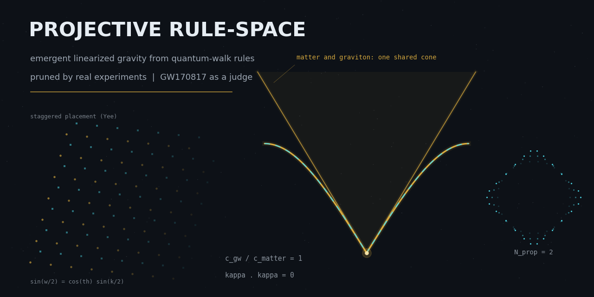
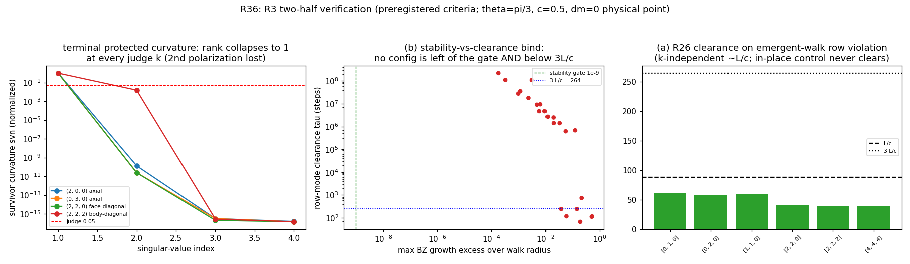
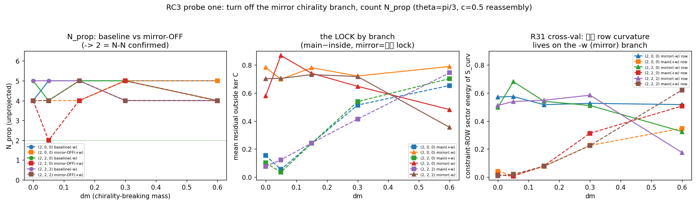
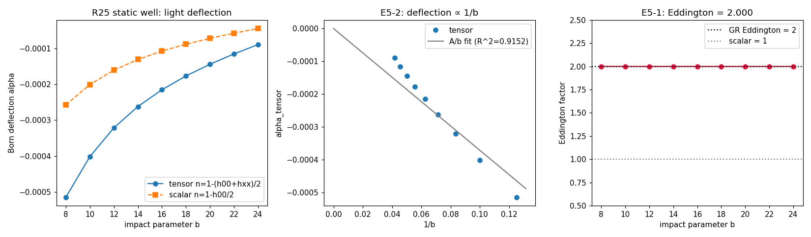
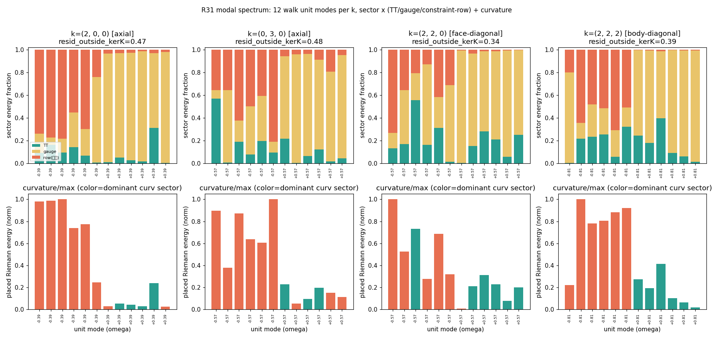
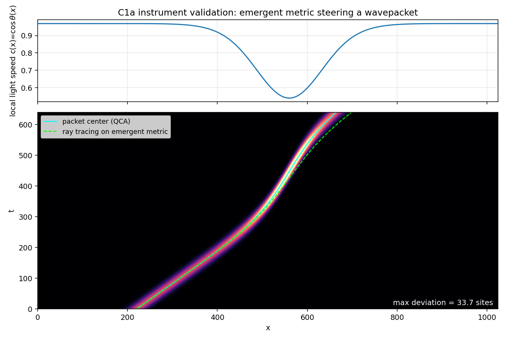
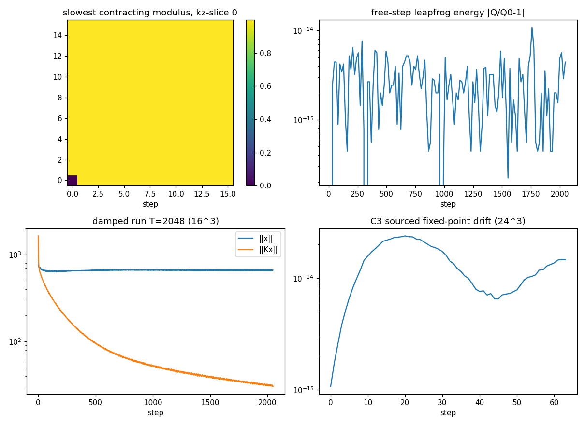

<p align="center">
  
</p>

<h1 align="center">Computational Universe Lab</h1>

<p align="center"><strong>Projective Rule-Space Program · Emergence Boundary Cartography v2</strong></p>

<p align="center">
  <em>A QA-pruning search over local QCA rule-space for rules whose projections yield law-like<br>
  field theories — and an honest map of how far it got. Emergence is not binary; it is a measurable boundary.</em>
</p>

---

## What this is

A computational-physics research repo built around **experimental pruning**. In the space of local
quantum-cellular-automaton (QCA) rules, we use mathematical self-consistency and Maxwell / Einstein /
Yang–Mills against real 3+1D experiments as QA gates, searching for rule equivalence classes whose
projections yield field theories while retaining diagnosable high-dimensional projection residuals.
Fixed 3+1D is the current calibration surface, **not** an ontological dimension claim; dynamical
dimension is deferred past fixed-3+1D.

This is not product engineering. Verification is split into syntax/import checks, symbolic
certificates, physics gates, and long-run reproduction — there is no conventional unit-test framework.

## Status (2026-07-29)

> **The program has been upgraded to v2 “Emergence Boundary Cartography”; the authoritative entry is
> now [`docsv2/README.md`](docsv2/README.md).** The v1 North Star (spin-2 emergence M3) was formally
> sealed on 2026-07-26; `docs/` is frozen as v1 history and evidence chain — append-only, history
> never rewritten.

**v2 has closed two complete loops, M0′–M2′:**

| Milestone | Content | State |
|---|---|---|
| **M0′** | Instrument migration: basis-invariant calibers (principal-angle spectrum), dual-environment consistency, ε_DOF dimension criterion | ✅ |
| **M1′** | Maxwell full closed loop: one spin-1 rule passes every extreme-language gate; photons exactly 2, **ε_DOF=1 measured, zero hand-built** | ✅ PASS |
| **M2′** | Spin-2 coupled loop: R30 hand-built complex geometry sets the stage, emergent Dirac matter plays — **(ε_geo=0, ε_mat=1) point on the map** | ✅ PASS |
| **M3′** | Boundary cartography: the `(ε_geo, σ)` map is frozen as a 30-cell pilot before the formal `10²–10³` scan | ▶ Round 0 `READY-PILOT`; 30 cells unlocked, not run |

M3′ now has a signed [task book](docsv2/v2-任务书-M3-涌现边界制图.md) and a reproducible
[Round 0 report](docsv2/v2-小报告-M3-预飞-2026-07-29.md). The legacy partial-Yee R2 remains
rejected as spectral bookkeeping, while an independent same-state-space, strict-local real-space
`q` family passes Round 0 with fp64 symplectic defect `7.77e-16`, measured support radius 4, and a
`64³` full-Brillouin-zone maximum Verlet CFL number of `3.96396 < 4`.
**Only the 30-cell pilot is unlocked; it has not run, M3′ has neither passed nor failed, and the
formal scan remains locked.**

**The (ε,σ) map now has three complete closed-loop benchmark points:** R30 (ε=0, bare geometry),
Maxwell (ε=1, M1′), and the coupled point ((ε_geo=0, ε_mat=1), M2′). The coupled point's entire value
is accounting honesty — the stage is hand-built, the play is emergent, two integers each in their
place; **it is not “spin-2 emergence”** (ε_geo=0). The forbidden phrase holds.

**v1 sealed statement (red line, untouchable):** under all four commitments (exact constraint
propagation + emergent matter + strict locality + unitarity), **spin-2 M3 is structurally unreachable** —
it dies on polarization count and a stability deadlock (TT₂ axial 76.2° symmetry locks out the band∩ker C;
deadlock scaling has no tuning corridor), not on residual. The R30 existence theorem and R26 clearing
mechanism are unaffected. See
[`seal-2026-07-26-reachability-campaign`](docs/status/阶段封存-2026-07-26-可达性战役收束-自旋2M3结构性不可达.md).

📄 **Visual field log (v2 progress, program-atlas style):**
[`visualizations/dashboards/v2-progress-atlas.pdf`](visualizations/dashboards/v2-progress-atlas.pdf) —
a 6-page editorial summary of the M0′→M2′ arc with measured charts (ε_DOF ladder, T_cross prophecy,
(ε,σ) boundary map, the sealed-wall ledger).

## Figure gallery

> All figures below are real experimental artifacts from `visualizations/figs/`. A `PASS` in any
> `*_results.json` only denotes that file's declared local gate — not M3/M2′. Negative results are
> logged with the same weight as positive ones.

<table>
<tr>
<td width="50%" align="center">

**R36 · R3 two-half verification (v1 seal, three-line support)**



(a)-half R26 re-certified PASS (τ∈[39,62]≈L/c, clearable residual 2e-15); (b)-half FAIL on all three
lines: no stable bidirectional clearing coupling, ±ω 6-fold degeneracy ⟹ N_prop=[1,1,1,1]≠[2,2,2,2],
TT₂ symmetry locks out band∩ker C (principal angle 76.2°).

</td>
<td width="50%" align="center">

**RC3 · chiral-doubling N-N probe**



Mirror chiral branch located; closing the mirror branch still yields 4 ≠ 2 ⟹ **chiral doubling ruled
out as the main culprit**. The lesion (the lock) is confirmed on the −ω/mirror branch (R31
cross-check holds). Residual obstacle bifurcates; neither half is chiral-fixable.

</td>
</tr>
<tr>
<td width="50%" align="center">

**R25 · static Newton / Eddington candidate certificate**



Static Newton/Eddington→2.00 candidate certificate, auxiliary Wilson. R25 is a GR-compatible existence
construction — **must not be read as “GR emerged from the wide rule-space.”** Full real-space step,
dynamic Newton/Eddington remain unfinished.

</td>
<td width="50%" align="center">

**R31 · modal spectrum (constraint-row lock localization)**



The −ω branch carries all constraint-row locks (residual 0.58–0.78, 2–3 angular locks 40–90°); the +ω
branch is ~98% inside ker C (2TT+2gauge, residual 0.08–0.16, no locked angles) — cross-check that the
lesion sits on the −ω branch.

</td>
</tr>
<tr>
<td width="50%" align="center">

**C1a · instrument (basis-invariant caliber base)**



M0′ instrument migration product: principal-angle-spectrum invariants (replacing LAPACK-basis-dependent
per-mode statistics), ε_DOF subspace-dimension criterion (R30 ε=0, Maxwell ε=1, walk family [0.25,0.5]).

</td>
<td width="50%" align="center">

**R25 · real-space step**



The Laurent/de Donder/detour complex on the general walk shell is closed; this is the R25 real-space
stepping diagnostic. Usable constraint-shrinkage rate, moving source, live conservation remain unfinished.

</td>
</tr>
</table>

Full figure set (PNG/GIF/MP4) in [`visualizations/figs/`](visualizations/figs/); interactive dashboards
in [`visualizations/dashboards/`](visualizations/dashboards/) (`dashboard_v2.html` for v2,
`program_atlas.html` for the program visual overview, `v2-progress-atlas.html` for the v2 field log).

> ⚠️ `dashboard_tensor.html` and the legacy tensor campaign use the old five-parameter surrogate
> `(cg2,gamma,G,tr_sign,sigma)` and **cannot back R25/v2**. Its 1,470 `lawful_tensor` entries belong
> only to that surrogate and constitute no M-gate evidence.

## Directory layout

| Path | Contents |
|---|---|
| `rulespace/` | CPU/numpy reference physics package (kept at top level for import contracts) |
| `rulespace_gpu/` | MLX/JAX/numpy multi-backend physics package |
| `rulespace_v2/` | v2 frozen physics package (seven files + invariants/spin1) |
| `experiments/` | Standalone experiment & certificate scripts; byte-faithful migration preserves SHAs |
| `data/results/` | All JSON result files of record (read-only during freeze orders) |
| `data/campaigns/`, `data/sealed/` | campaign and sealed data |
| `data/runtime/` | runner-resumable state (has delete semantics; never reset without explicit request) |
| `visualizations/` | dashboards, figs, assets (incl. repo cover) |
| `docsv2/` | **v2 document system (authoritative entry)**: program, preregistrations, reports, reviews, rulings, closures |
| `docs/` | v1 history & evidence chain (frozen, append-only) |
| `tools/` | campaign runner, local observation server |

## Quick verification

```bash
bash setup_env.sh
source .venv/bin/activate
export RULESPACE_BACKEND=jax

python -m rulespace_gpu.verify      # backend self-check
python -m rulespace_gpu.benchmark   # benchmark
python experiments/exp1_dirac_qca.py
python experiments/r25_laurent_complex.py
```

Machine-precision certificates use jax/numpy **fp64**; MLX is for large-scale dynamics and **must not
be used to claim `1e-12`-level gates** from fp32.

Run the interactive dashboards:

```bash
python tools/campaign_server.py
# open http://localhost:8765/ in a browser
python tools/campaign_runner.py status
python tools/tensor_campaign_runner.py status
```

## Reading order

**v2 (current program, authoritative):**

1. [`docsv2/README.md`](docsv2/README.md) — v2 document-system entry
2. [`docsv2/v2-纲领-北极星-涌现边界制图.md`](docsv2/v2-纲领-北极星-涌现边界制图.md) — thesis, claim tiers, M0′–M4′ gates
3. [`docsv2/v2-收口-M1-2026-07-27.md`](docsv2/v2-收口-M1-2026-07-27.md) — M1′ Maxwell closure
4. [`docsv2/v2-收口-M2-2026-07-27.md`](docsv2/v2-收口-M2-2026-07-27.md) — M2′ coupled-point closure
5. [`docsv2/v2-资产重审计-2026-07-26.md`](docsv2/v2-资产重审计-2026-07-26.md) — v1 asset triage & v2 inheritance list
6. [`visualizations/dashboards/v2-progress-atlas.pdf`](visualizations/dashboards/v2-progress-atlas.pdf) — v2 visual field log

**v1 (history & evidence chain, frozen):**

1. [`seal-2026-07-26`](docs/status/阶段封存-2026-07-26-可达性战役收束-自旋2M3结构性不可达.md) — v1 sealed statement (why v2 exists)
2. [`docs/status/HANDOFF_02_结果总账.md`](docs/status/HANDOFF_02_结果总账.md) — results ledger (43-series, row by row)
3. [`docs/reports/小报告-R30独立复核-张量复形存在性证得.md`](docs/reports/小报告-R30独立复核-张量复形存在性证得.md) — R30 existence theorem
4. [`docs/engineering/REPOSITORY_LAYOUT.md`](docs/engineering/REPOSITORY_LAYOUT.md) — engineering layout

Working discipline and red lines are in [`AGENTS.md`](AGENTS.md) (on conflict with `CLAUDE.md`,
`AGENTS.md` and the latest user instruction prevail).

## Research discipline

- Verified physics is split into hard gates H, structural priors S, exploratory residuals E. Experimental
  laws constrain the universality class of the projection; they do not pin a unique UV rule per lattice.
- A `PASS` in any `*_results.json` only denotes that file's declared local gate; any M-gate must be
  passed in a single unified real-space run.
- **Negative results, corrections and voided runs are logged with the same weight as positive ones**;
  thresholds are never moved after a run (moving a threshold = moving the goalposts).
- The v1 seal is untouchable; new results go to `data/results/`, new v2 reports to `docsv2/`, v1 history
  status-lines to `docs/`.
- Certificates are fp64 only; the forbidden phrase “spin-2 emergence” holds permanently in the v2 context.
- Fixed 3+1D is the current testable projection, not an ontological dimension claim; dynamical dimension
  is deferred past fixed 3+1D.

## License

Released under the [MIT License](LICENSE). Copyright © 2026 Computational Universe Lab contributors.

The software, experiment scripts, results data, and documentation in this repository are provided for
research reproducibility. Negative results, sealed findings, and frozen evidence chains are part of the
record and are released under the same terms.
