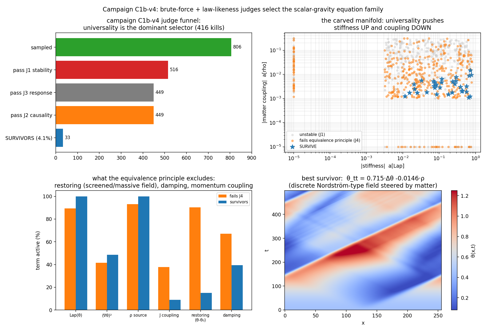

# 战役报告 C1b-v4:暴力搜索 × 定律性裁判,第一轮

*rulespace基建首战。目标:在动力学coin场的耦合规则空间里,让裁判(而非人)决定什么样的"规则场方程"配存在。*

---

## 基建(已交付,`rulespace/`包)

**core**:非均匀split-step行走(局域coin角θ(x,t),涌现光速 $c(x)=\cos\theta(x)$,仪器验证:平台测速误差<0.5%,弯曲区光线追踪偏差≈波包宽度);动力学coin场 $\theta_{t+1}=2\theta_t-\theta_{t-1}+\sum_i a_i O_i$,算子库 $\{\Delta\theta,(\nabla\theta)^2,\rho,J,\theta-\theta_0,\dot\theta\}$。
**judges**:四级漏斗——J1稳定性、J3物质响应、J2因果性、**J4等效原理**(观察者用受限模型 $\theta_{tt}=b_1\Delta\theta+b_2\rho$ 拟合,要求 $(b_1,b_2)$ 对三种物质态——不同动量、不同宽度、不同能标——不变,且约化定律本身 $R^2>0.9$)。
**campaign**:稀疏物理先验采样+预算控制+JSONL存储。**discover**:贡献尺度阈值的STLSQ(控制回路验证:主导项回收至 $10^{-14}$)。

## 三个裁判bug=第一轮真正的方法论产出

1. **因果性裁判测到了高斯尾巴**:扰动的初始尾部被当成传播锋面(v≈2.2)。教训:半径-1模板的锋速结构上≤1,因果性对这类规则族是自动的;裁判改为单点扰动+晚期窗口锋速。
2. **二步混叠**:轨迹隔步记录使回归库把二步映射当一步拟合。教训:发现层的采样率必须匹配动力学步长。
3. **空虚的等效原理**:当裁判拟合库包含全部真实生成项时,拟合精确恢复注入方程,普适性构造性成立、判据失效。教训(重要):**等效原理判据的力量恰恰来自观察者模型与微观规则之间的错位**——观察者只拟合"牛顿定律",被截断的项才会泄漏成态依赖。这是裁判设计的一般原理,适用于后续所有战役。

## v4结果(806候选,三批)

**漏斗:** J1杀290(36%) → J3杀67 → J2杀0(结构性保证) → **J4杀416** → 存活33(4.1%)。等效原理是主导筛选器。

**存活流形=离散标量引力方程族:**

$$
\boxed{\ \theta_{tt} \;=\; c_g^2\,\Delta\theta \;+\; \kappa\,\rho\ }\qquad(\text{纯波动+普适源, } R^2_{\rm reduced}=1.000)
$$

最优个体:$\theta_{tt}=0.715\,\Delta\theta-0.0146\,\rho$,普适性距离 $7\times10^{-15}$。

**选择压力的方向(J4淘汰者→存活者,中位数):**

| 项 | 激活率变化 | 幅度变化 | 解读 |
|---|---|---|---|
| $\Delta\theta$ 刚度 | 89%→100% | 0.047→**0.117 ↑** | 普适性要求真正的双曲传播 |
| $\rho$ 源耦合 | 93%→100% | 0.0098→**0.0032 ↓** | 普适性偏爱弱耦合(引力是最弱的力,在这里是被选出来的) |
| 恢复项 $(\theta-\theta_0)$ | **90%→15%** | →0 | **有质量/屏蔽型标量场被排除**:屏蔽长度与波包宽度耦合,破坏态无关性 |
| 阻尼 | 67%→39% | →0 | 耗散破坏普适性 |
| 动量耦合 $J$ | 38%→9% | →0 | 源必须是能量密度,不能是动量 |
| $(\nabla\theta)^2$ | — | 压到微小 | 非线性一阶排除(但见"下一轮") |

**引力符号独立性:** 存活者中仅42%满足"物质使光变慢"(吸引型)。**等效原理不决定引力的符号**——普适性与吸引性是独立公理轴,与真实物理的结构一致(GR里吸引来自能量正定+场方程符号,不来自等效原理本身)。

## 诚实的边界

算子库只有6项,"波动+源"本就在可表达集合里——本轮证明的不是"引力方程被发明",而是**"等效原理裁判在无人指认的情况下把它唯一挑了出来,并给出了排除谱(无质量、无耗散、能量作源、弱耦合)"**。选择压力的每个方向都有真实物理对应,这是判据设计正确的证据。1+1维标量引力≠GR;$\rho$ 是概率密度而非正规化的应力-能量;三种物质态还不含不同色散(质量)的第二物种。

## 下一轮(按预期收益排序)

1. **符号公理**:加入能量正定判据,看它与普适性联合是否唯一固定吸引符号——若是,"引力为什么吸引"在这个玩具里变成定理。
2. **第二物种**:有质量行走者加入普适性测试(真正的Eötvös实验类比),预期大幅收紧存活流形。
3. **富化算子库**:$\theta$ 依赖的刚度 $c_g^2(\theta)$、$\rho\theta$ 交叉项、更高阶导数——让"发现层"有机会输出非平凡修正(GR的非线性正是 $c_g^2(\theta)$ 型)。
4. **连续极限**:对存活族做实验①式的收敛阶测量,提取连续方程,与Nordström理论逐项比对。
5. **自洽闭环(C1本体)**:用行走者的真实应力-能量(而非ρ代理)作源,检验存活方程是否恰是"约束传播自洽"的解——那一步做成,就是从"裁判选出"升级到"自洽性推出"。
