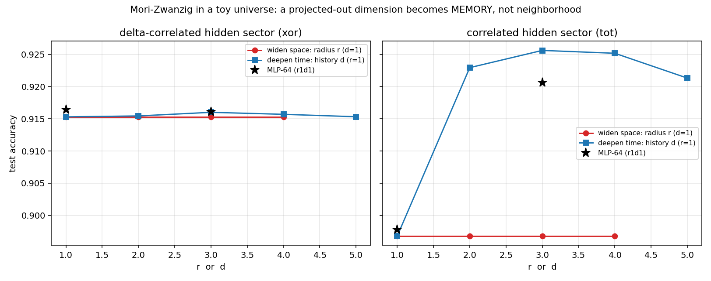
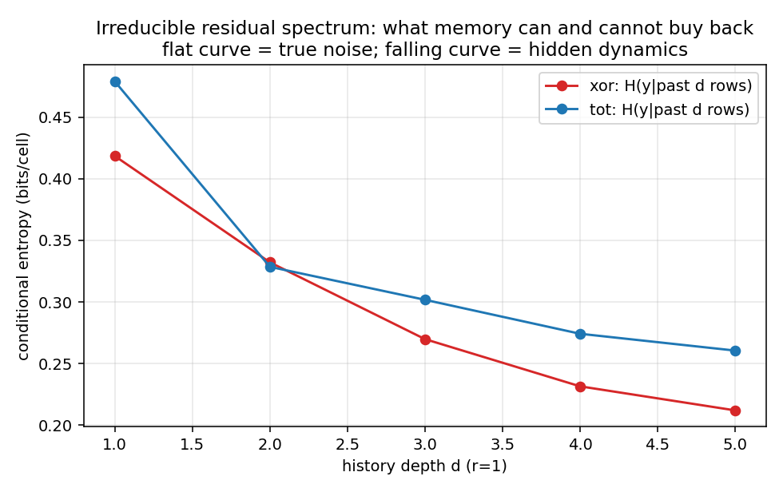
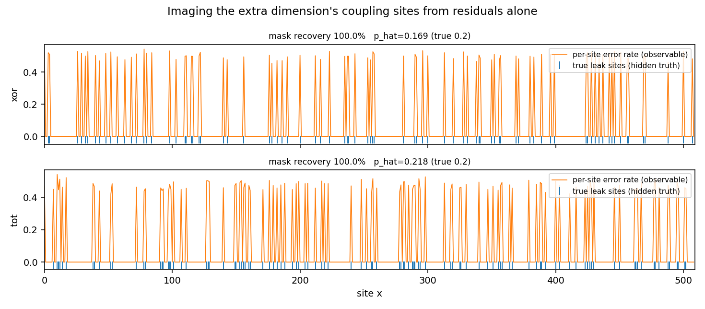
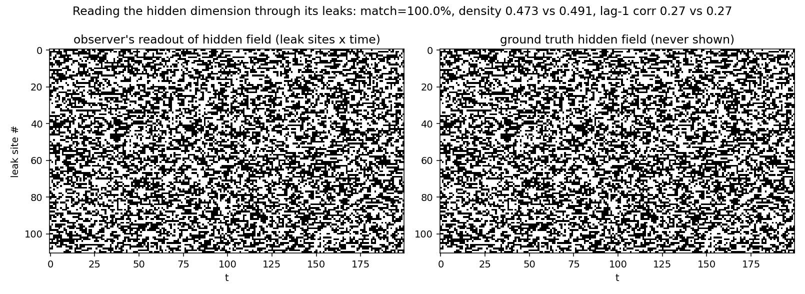
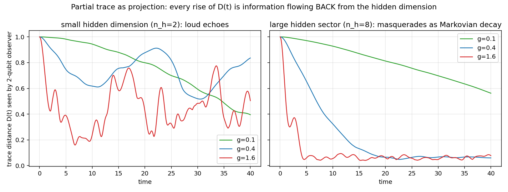
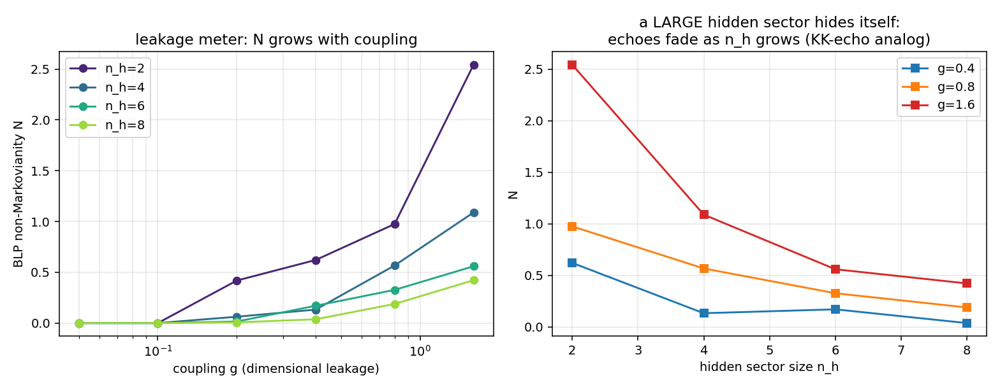
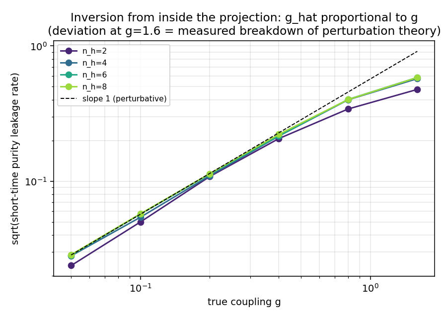

# 中期实验:被投影掉的维度去哪了——记忆与回声

*承接《计算宇宙三实验》。两个升级实验共享同一个数学核心(Mori-Zwanzig形式):把自由度投影掉,它们不会消失,而是转化为可见动力学中的**记忆核+噪声**。这个转化是可测的、可反演的——这就是"出路"的定量形态。*

复现:`exp4_residual_spectrum.py`(分stage: gen/fit/ml/figs)、`exp5_quantum_projection.py` + `exp5_figs.py`。

---

## 实验④ 不可约残差谱:空间买不回的,时间可以——如果隐藏扇区有关联

**设置。** 沿用泄漏模型(H=8, p=0.2),但隐藏扇区分两种:δ-关联型(xor规则,时间关联0.00——白噪声浴)和有关联型(tot规则,时间关联0.63——物理上更普遍的情形)。拟合模型从查表升级为(空间半径r × 时间深度d)的完整网格,外加逻辑回归和MLP-64对照。

**结果一:Mori-Zwanzig预言精确应验。**

有关联隐藏扇区:加宽空间半径r=1→4,精度纹丝不动(0.8968,四位小数);加深时间历史d=1→2,精度立刻跳升0.897→0.923。**被投影掉的空间维度变成时间记忆,一点不变成空间邻域。** δ-关联隐藏扇区:r和d全部平坦(0.9153)——这部分残差是真正不可约的噪声,任何模型都救不了。

**结果二:残差谱的形状=隐藏扇区的关联结构。**

条件熵随记忆深度的衰减曲线:平坦=隐藏扇区无记忆,下降=隐藏扇区有动力学。一维观察者不出投影就能测出"外面那个东西"的关联时间。这回答了"消不掉的模式指向什么隐藏代数结构":**残差的时间谱直接就是隐藏扇区动力学的谱指纹。**

可微模型对照:MLP-64精确贴合查表上限(0.9164 vs 0.9153;深度增益同样复现0.898→0.921),证明结论不依赖模型类别;逻辑回归卡死在0.70——因为定律本质非线性,这提醒我们模型的**表达力类别**(能否表达XOR)比可微性重要。

**结果三(出路的上半部):反演管线全部成功。** 一维观察者仅凭自己的数据:

| 反演量 | 观察者的估计 | 真值(从未展示) |
|---|---|---|
| 泄漏位点成像(mask) | 100%恢复 | — |
| 耦合密度 p̂ | 0.218 | 0.2(该实现的实际密度) |
| 隐藏场直读精度 | 100% | — |
| 隐藏场密度 | 0.473 | 0.491 |
| 隐藏场时间关联 | **0.273** | **0.274** |

机制:逐位点误差谱把泄漏位点成像出来(误差率在泄漏位点上突起,干净位点为零);在干净位点观察者学到精确定律;于是泄漏位点的残差=隐藏场的逐位直读。**"测不掉的误差"从垃圾变成了望远镜。**

---

## 实验⑤ 量子版:partial trace作投影,信息回流作泄漏计

**设置。** 2+n_h个量子比特的Heisenberg链:2个可见,n_h个隐藏(随机z场使其非简并),可见-隐藏键强度g=维度泄漏。可见观察者只有约化密度矩阵 ρ_v(t)=Tr_hidden。度量:BLP非马尔可夫性——两个初始可分辨的可见态的迹距离D(t),马尔可夫动力学下单调下降,**每一次回升都是信息从隐藏维度流回来**,N=Σ正增量。

**结果一:小的隐藏维度会发出响亮的回声,大的会把自己藏起来。**

N(g, n_h)矩阵:N随g单调上升(泄漏计有效);固定g,N随n_h**下降**(n_h=2, g=1.6: N=2.54 → n_h=8: 0.42)。物理翻译:**紧化的小额外维度产生可探测的回声(KK共振的开放系统类比),而巨大的隐藏扇区把信息吞掉、完美伪装成马尔可夫噪声。** 这给"为什么我们还没看见高维结构"提供了一个结构性答案:看不见恰恰兼容于两种截然相反的本体(没有隐藏维度 / 隐藏维度太大),能区分它们的只有回声的有无。

**结果二(出路的下半部):耦合强度可以从投影内部测出。**

短时纯度泄漏率 1−Tr ρ² ≈ c·g²t²,√c/g 在微扰区恒定(0.57±0.02,对g跨32倍、n_h跨4倍都成立)→ ĝ∝g可反演;g=1.6处比值坍塌到0.37——**连微扰论的失效边界本身也被从内部测出来了**。这与经典侧的 p̂=2δ 是同一个结论的两个化身。

---

## 综合:出路的完整形状

两个实验拼出同一幅图:

1. **投影不毁灭信息,只改变信息的形态。** 空间维度→时间记忆(经典,Mori-Zwanzig);隐藏自由度→信息回流(量子,BLP)。两者是同一个定理在两种力学中的投影。
2. **因此"陷入局部最优"有内在的报警器。** 上一轮我们发现搜索会收敛到"令人信服的错误定律"(rule 154 @ 88.8%);本轮证明:那11.2%的残差不是均匀的噪声——它有空间谱(成像泄漏位点)、时间谱(测隐藏关联)、并且可以被直读。**只要检查残差的谱结构,错误定律就无法伪装成完备定律。** 唯一原则上无法击穿的情形:隐藏扇区恰好δ-关联且泄漏无空间结构——而这在物理上是零测度的特殊情形。
3. **反演管线给出的是研究纲领,不只是玩具结论。** 现实版对应:洛伦兹破坏界限→泄漏耦合上界(实验②③);"反常"的谱结构(如果有)→隐藏扇区的关联时间;寻找回声(非马尔可夫回流、共振)→区分"无隐藏维度"与"隐藏维度太大"。

**诚实的limit:** 经典侧的mask是静态的(动态泄漏位点会让成像变成追踪问题);量子侧n_h≤8远非热力学极限,且Heisenberg链不混沌到极致(可换随机矩阵浴验证普适性);"隐藏场直读100%"依赖泄漏项的代数形式(XOR泄漏可逆),更一般的泄漏只能给出有噪读数;BLP对测量分辨率敏感,真实实验中N的下界才可测。最重要的:所有这些都还是"给定本体,验证可探测性"的正向游戏,真实处境是只有投影、本体未知——但这正是这套管线的用途:它输出的每一个量(记忆谱、回声谱、泄漏图)都是对未知本体的一个约束。

**下一步(如果继续):** ①把泄漏实验搬进实验①的狄拉克QCA——预言色散修正的具体形式,与真实洛伦兹破坏界限(GRB、原子钟)对接,这是玩具触碰真物理的最短路径;②量子侧把BLP换成过程张量(process tensor)形式,可以完整重构记忆核而不只是一个标量;③经典侧让mask随时间演化,测试成像管线的极限。
