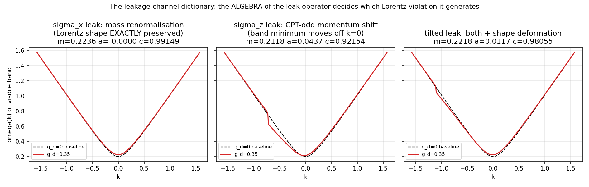
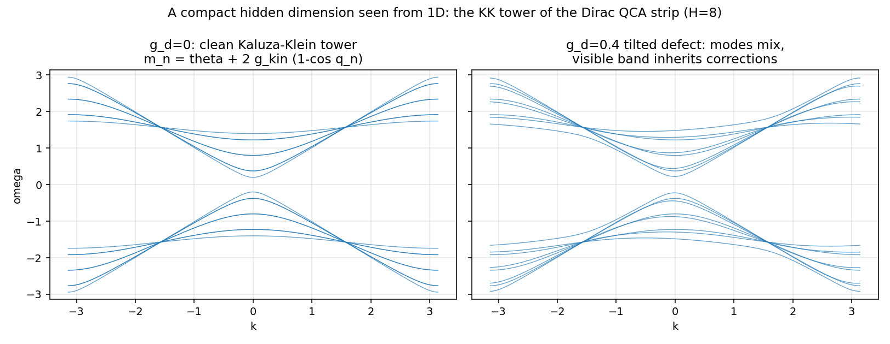
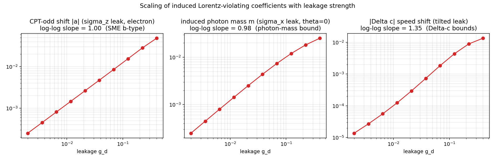
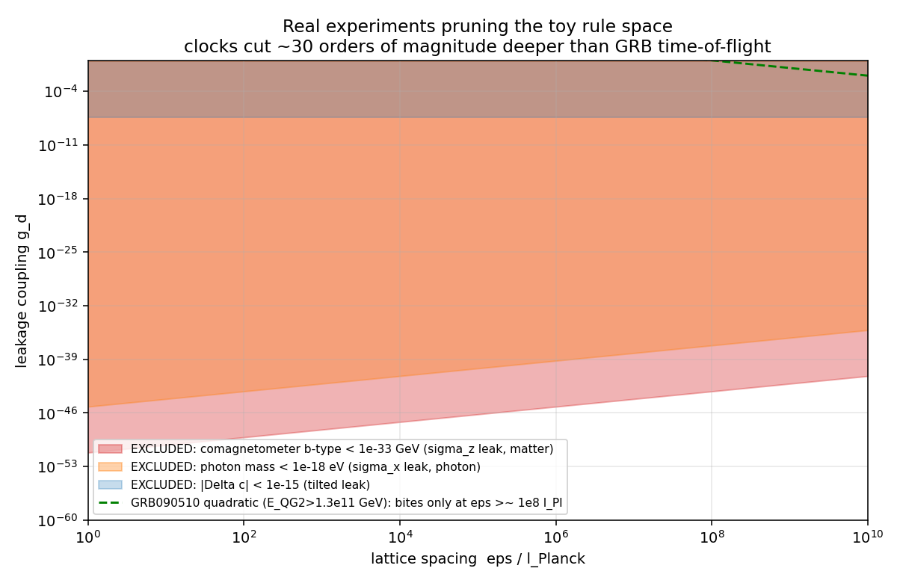

# 实验⑥:泄漏进入狄拉克QCA——色散修正的形式,与真实洛伦兹破坏界限的对接

*承接前两轮:实验①证明QCA能算出狄拉克物理,实验③④证明维度泄漏可测可反演。本轮把两者合并:在狄拉克QCA上加一个紧化隐藏维度(格点Kaluza-Klein),推导泄漏在可见色散关系上留下的印记,然后让真实实验数据来剪枝。*

复现:`exp6_kk_dispersion.py`。全部系数为数值精确对角化结果(2H×2H幺正算符逐k本征相位),非微扰近似。

---

## 设置

可见维度x(无限)× 紧化隐藏维度y(H=8格点,周期)。演化 U = X(k)·C(θ)·L:X是自旋条件平移,C(θ)是质量币,L = exp(iM) 包含两项——KK动能项 g_kin·Δ_y⊗σ_x(给出干净的KK塔 m_n = θ + 4g_kin sin²(q_n/2),n=0是我们的可见粒子)和**泄漏缺陷** g_d·|y=0⟩⟨y=0|⊗σ_c(破坏隐藏维度平移不变性、混合KK模式——实验③④里mask的量子场版本)。σ_c是泄漏算符的自旋通道,这是本实验的核心变量。

## 发现一:泄漏算符的代数决定它生成哪类洛伦兹破坏——一部字典

| 泄漏通道 | 与谁对易 | 生成的效应 | 数值验证 | 哪个实验剪它 |
|---|---|---|---|---|
| σ_x | 质量币 | **纯质量重整化**,洛伦兹形状精确保持 | a=0.0000,形状残差=0 | 色散实验完全失明;但对无质量粒子=**诱导光子质量**,被光子质量界限剪 |
| σ_z | 平移 | **CPT-odd动量偏移** k→k+a,能带最低点偏离k=0,自旋依赖 | a = g_d/H,一阶,斜率1.000,α=0.1250=1/8精确 | 原子钟/共磁强计(SME b型系数) |
| 混合(tilt) | 都不 | 质量偏移+动量偏移+**真形状形变**(Δc、k³/k⁴项) | Δc含O(g)与O(g²)混合(见下) | Δc界限、(微弱地)GRB |

这是本轮最重要的结构性结论:**"泄漏多强"之前先问"泄漏往哪个代数方向"。** 同样大小的g_d,σ_x方向的泄漏对所有色散实验隐形,σ_z方向的会被地球上的桌面实验抓个正着。

## 发现二:KK塔与共振指纹

g_d=0时是干净的KK塔;开启缺陷后模式混合。注意字典图σ_z面板k≈−0.7处的扭结:那是可见能带与一条KK模式的**避免交叉**——隐藏维度的共振指纹,正是实验⑤"回声"的能带语言版本。如果真实世界有紧化维度且泄漏不为零,这类共振(特定能量处色散的局域畸变)是比整体k³项更尖锐的信号。

## 发现三:标度律

CPT-odd偏移 a = g_d/H 精确一阶(斜率1.000);诱导光子质量 m ≈ g_d/H 一阶(斜率0.975);Δc的标度是1.35——介于1和2之间,因为它混合了两个来源:直接的O(g²)项,和一个O(g)的间接项(格点上c依赖质量,δm→δc)。后者本身是离散性的印记:**在格点宇宙里,不同质量的粒子天生有不同的极限速度**,这在g_d=0时就存在(θ=0.2的基线c=0.9915≠1),泄漏只是放大它。

## 发现四:真实实验的剪枝刀,各有各的深度

把格距ε(以普朗克长度计)和泄漏g_d铺成参数平面,代入真实界限:

ε = l_Planck 处的许可上限:

| 通道 | 界限来源 | g_d 上限 |
|---|---|---|
| σ_z(物质扇区) | 共磁强计 b̃ ≲ 10⁻³³ GeV | **6.6×10⁻⁵²** |
| σ_x(光子扇区) | 光子质量 < 10⁻¹⁸ eV | 6.6×10⁻⁴⁶ |
| 混合 | \|Δc\| < 10⁻¹⁵ | 3.9×10⁻⁸ |
| 任意通道的k³/k⁴项 | GRB 090510: E_QG,2 > 1.3×10¹¹ GeV | **无约束**(ε≳10⁸ l_Pl才开始咬合) |

三个教训:

1. **名气最大的刀最钝。** GRB飞行时间实验对这个模型完全无力——因为1D QCA的无质量模式色散精确线性(cos ω = cos k → ω=k),离散性不产生一阶色散修正;泄漏产生的形状项从二阶起,而二次LIV的实验界限(E_QG,2~10¹¹ GeV)远够不到普朗克尺度。这与D'Ariano纲领对3D Weyl QCA的结论一致:离散时空模型天然逃过一阶GRB界限。
2. **真正的刀在桌面上。** 共磁强计对CPT-odd通道的剪枝比GRB深约45个数量级(10⁻⁵² vs 无约束)。如果元定律的泄漏有任何σ_z型分量,它在普朗克格距下必须小于10⁻⁵¹——这实际上是说**该通道必须被对称性精确禁止,而不是碰巧很小**。
3. **因此存活流形由代数刻画,不由大小刻画。** 回到实验②的语言:实验剪枝后的规则空间不是"泄漏很小的规则",而是"**泄漏算符恰好落在与质量重整化对易的通道里**的规则"。一个自然的宇宙学猜想式陈述:可行的计算宇宙规则要么无泄漏,要么其泄漏被规范对称性投影到σ_x型通道——后者的全部效应是重整化我们已经测到的常数,原则上不可探测但也无害。这就把"高维元定律是否存在"从形而上学问题变成了泄漏算符的分类问题。

---

## 诚实的limit

一维玩具到3+1维的映射是数量级级别的,不是严格的:σ_z偏移与SME b_μ系数的对应基于两者都是自旋耦合CPT-odd背景,但严格匹配需要在3+1维QCA上重做(D'Ariano已给出3D Weyl QCA,可行);H=8、静态单点缺陷是最简泄漏,动态/延展缺陷会给出不同的共振结构;共磁强计界限取10⁻³³ GeV是保守数量级(最新数据表中部分中子系数已到10⁻³⁴);Δc界限10⁻¹⁵取的是保守值,部分天体物理界限更紧;我们假设了泄漏只通过色散显形,忽略了衰变道(KK模式如果可以被激发,还有丢失能量到隐藏维度的"缺失能量"信号——对撞机界限,未纳入)。

## 三轮实验的完整弧线

实验①:离散规则能产出真物理(收敛阶2.01)。实验②:实验精度→规则空间体积的汇率。实验③④:投影陷阱真实存在,但残差有谱、可反演,隐藏结构可从内部测绘。实验⑤:量子版,回声区分"无隐藏维度"与"隐藏维度太大"。实验⑥:泄漏的代数通道决定死活,真实桌面实验已经把某些通道剪到10⁻⁵²——**"用已验证物理剪枝计算宇宙"不但可行,而且已经可以开始了:它剪的不是参数,是算符代数。**

下一步若继续,自然的升级是把整套管线搬到3+1维Weyl QCA(D'ariano-Perinotti框架)上做严格的SME系数匹配,以及把动态泄漏(实验④的时变mask)与本轮的共振指纹结合,预言"色散畸变的时间调制"这类更奇异、也更可证伪的信号。

---

**Sources:**
- [Constraints on Lorentz invariance violation from Fermi-LAT observations of gamma-ray bursts, Phys. Rev. D 87, 122001](https://link.aps.org/doi/10.1103/PhysRevD.87.122001) — GRB 090510: E_QG,1 > 7.6 E_Pl, E_QG,2 > 1.3×10¹¹ GeV
- [A limit on the variation of the speed of light arising from quantum gravity effects, Nature 462, 331](https://www.nature.com/articles/nature08574)
- [Data Tables for Lorentz and CPT Violation, Kostelecký & Russell (arXiv:0801.0287, 2026年1月更新版)](https://arxiv.org/pdf/0801.0287) — SME各扇区系数界限汇编(含共磁强计b̃~10⁻³³–10⁻³⁴ GeV)
- [Observational Constraints on Local Lorentz Invariance (arXiv:1302.1150)](https://arxiv.org/pdf/1302.1150)
