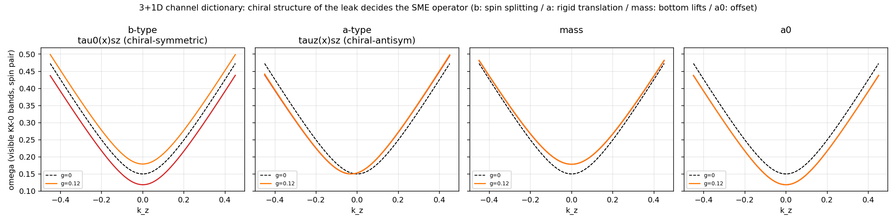
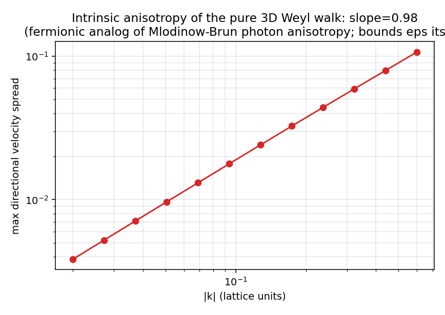
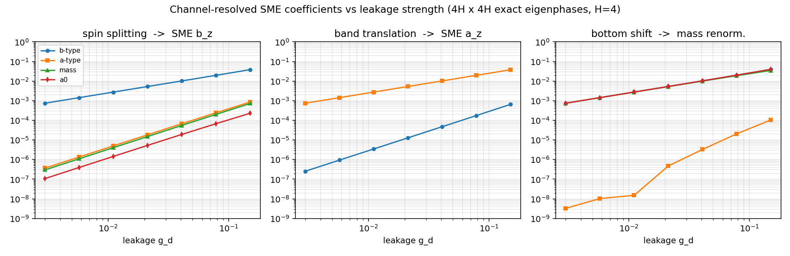

# 实验⑦:3+1维Weyl/Dirac QCA的SME系数匹配 + 完整novelty排查

*两条线并行的结果:文献排查确定了我们的位置,3+1维实现确认了字典在真实自旋结构下成立——而且比1D版更锋利。*

复现:`exp7_3d_weyl_sme.py`。排查:研究子代理通读arXiv:2506.20136全文(593行)+ 引用网络爬取 + 约80条检索结果核查。

---

## 第一部分:novelty排查结论

**最重要的事实:arXiv:2506.20136(Mlodinow & Brun 2025)没有占住我们的位置。** 全文精读确认:该文是光子扇区、Amelino-Camelia型E_QG参数化(全文无任何SME系数)、纯3D平移不变格子、单参数Δx。他们用LHAASO GRB 221009A数据得到Δx ≲ 5.8×10⁻³⁶ m(约l_Pl/3),用旋转光学腔得到Δx ≲ 6.5×10⁻²⁶ m。无隐藏维、无缺陷、无CPT-odd、无通道分类。

逐项裁定:

| 我们的元素 | 裁定 | 最近的先例 |
|---|---|---|
| ① QCA↔SME逐系数匹配(费米子) | 部分先例 | 2506.20136(光子、非SME);Grushin PRD 86, 045001:Weyl半金属格点模型实现b_μ型LV-QED(凝聚态方向,必引) |
| ② 格点KK塔+平移破缺泄漏缺陷 | 缺陷部分无先例 | KK塔:1607.08191(圆柱量子行走);其全部被引文献中**无人加缺陷、无人接LIV界限**。紧化维→CPT-odd:Klinkhamer的CPT反常(拓扑机制,系数由紧化半径固定;我们是缺陷机制,系数由g和ε可调——必须正面区分) |
| ③ 算符代数通道→SME算符类型字典 | **未发现先例** | 字典右侧(SME按C/P/T分类)是Kostelecký现成的;**左侧(微观QCA泄漏算符的对易/手征结构选择系数类型)及映射本身无先例** |
| ④ 按通道的(ε,g)二维排除平面 | 未发现先例 | 体裁类比:Sarrazin-Petit膜世界中子泄漏排除图(无SME、无自旋) |

**审稿人最可能的攻击及防线:** (1) Collins et al. (PRL 93, 191301):任何普朗克离散性经圈图修正会产生O(10⁻²)级c_μν,与观测冲突——防线:我们的通道分析恰好给出圈图混合的选择定则,树图级"对易通道"是否受辐射保护本身是可研究的新问题(可转为卖点);(2) "字典只是spurion分析的格点重述"——防线:QCA幺正性带来非平凡差异(shift与coin不对易、Brillouin区结构),且我们给出的是构造性微观推导而非对称性论证;(3) D'Ariano学派主张变形协变(DSR)而非SME破缺——防线:缺陷破坏了DSR重解释所需的对称性,SME EFT恰是带缺陷QCA的正确低能语言。

---

## 第二部分:3+1维实现与结果

**构造。** 右手Weyl行走 W_R(k)=e^{ik_zσ_z}e^{ik_yσ_y}e^{ik_xσ_x}(立方格,最近邻,幺正);左手配对W_L(−k);质量币C(θ)=exp(iθτ_x)成4分量Dirac;紧化第四维w(H=4格点),KK动能取τ_y通道(与α_i、β都反对易→真KK塔:m_n²=θ²+(g_kin λ_n)²,**数值验证到0.4%**);泄漏缺陷g_d|w=0⟩⟨w=0|⊗Γ。

**核心结果:字典在3+1维由手征结构接管,四个通道四种教科书指纹。**

| 泄漏通道Γ | 手征结构 | 生成的SME算符 | 数值验证(斜率/系数) | 命运 |
|---|---|---|---|---|
| τ₀⊗σ_z | 手征对称 | **b_z**(自旋耦合CPT-odd) | 自旋劈裂:斜率1.005,α=0.2500=1/H精确 | 共磁强计剪到~10⁻⁵² |
| τ_z⊗σ_z | 手征反对称 | **a_z**(可移除) | 刚性平移α=1/H;劈裂与能移严格为零(<10⁻¹⁴) | **物理不可见**(单物种无引力时场重定义移除) |
| τ_x⊗I | 质量币方向 | 质量重整化 | 抬底斜率0.98,α=1/H;无平移无劈裂 | 不可探测且无害 |
| τ₀⊗I | 标量 | a₀(能量偏置) | 整体下移α=1/H | 单物种不可见 |

1D版的"σ_z通道被剪"在3+1维分裂成了更精细的二分:**同样的σ_z泄漏,手征对称的版本(τ₀⊗σ_z)是被桌面实验判死刑的b_μ,手征反对称的版本(τ_z⊗σ_z)是完全无害的a_μ。** 生死之差不在大小、不在方向,而在泄漏算符在手征空间的一个符号。这是比1D更强的结论:可行规则流形由离散对称性(手征结构)刻画,搜索空间的剪枝条件可以写成算符代数的精确判据。

**基线各向异性(与Mlodinow-Brun对接)。**

纯3D Weyl行走的方向速度差随|k|线性增长(斜率0.98),系数0.19——这是Mlodinow-Brun光子扇区各向异性(RMS系数0.35)的费米子版,意味着他们的光学腔式分析可平移过来独立约束我们的ε。两条约束正交:**各向异性约束格距ε,通道字典约束泄漏代数**——完整的(ε, g, Γ)三维排除结构,文献中不存在。

---

## 定位声明(如果写成论文)

**标题级主张:** "Hidden-dimension leakage in quantum cellular automata generates Standard-Model-Extension coefficients whose type is selected by the operator algebra of the leak, not its magnitude; tabletop CPT-odd bounds then exclude entire algebra channels at Planck-scale lattice spacing."

**必引并区分:** Mlodinow-Brun 2025(光子/E_QG/无隐藏维)、D'Ariano-Perinotti纲领(1601.04842等,DSR立场)、Márquez-Martín et al. 1607.08191(KK塔无缺陷)、Klinkhamer CPT反常(拓扑机制vs我们的缺陷机制)、Grushin 2012(凝聚态b_μ实现)、Sarrazin-Petit(膜泄漏排除图体裁)、Collins et al.(圈图攻击,正面回应)。

**诚实的limit:** H=4、单点静态缺陷;b_μ匹配是树图级、单粒子扇区,圈图混合未做(这是下一篇的题目);a_μ"不可见"结论仅对单物种平直时空成立(多物种差分或引力下a_μ可观测);我们的"共磁强计剪到10⁻⁵²"沿用1D的数量级映射,3+1维的精确系数换算(含方向平均、恒星参考系变换)还需一节标准SME流程。

## 三轮之后的全景

这个从"能不能借场概念推广CA"开始的讨论,现在收束为一个可发表的研究纲领:离散计算宇宙的规则空间被真实实验剪枝,剪枝判据是算符代数而非参数大小;隐藏维度泄漏不可怕——它要么落在被对称性保护的通道里(质量/速度重整化,无害),要么留下谱指纹(自旋劈裂、KK共振、记忆核、信息回声),而每一种指纹都有现成的实验在等它。

---

**Sources(排查全部来源见正文表格,关键项):**
- [Mlodinow & Brun, Bounds on QCA Lattice Spacing from Data on Lorentz Violation (arXiv:2506.20136)](https://arxiv.org/abs/2506.20136)
- [Bisio, D'Ariano, Perinotti, Tosini, Weyl/Dirac/Maxwell QCA phenomenology (arXiv:1601.04842)](https://arxiv.org/abs/1601.04842) · [Doubly-Special Relativity from QCA (arXiv:1310.6760)](https://arxiv.org/abs/1310.6760)
- [Quantum walk on a cylinder (arXiv:1607.08191)](https://arxiv.org/abs/1607.08191)
- [Klinkhamer, CPT anomaly: lattice proof (arXiv:hep-th/0205038)](https://arxiv.org/abs/hep-th/0205038) · [综述 (arXiv:1709.01004)](https://arxiv.org/abs/1709.01004)
- [Grushin, LV-QED in Weyl semimetals, PRD 86, 045001 (arXiv:1205.3722)](https://arxiv.org/abs/1205.3722)
- [Sarrazin & Petit, brane matter-exchange bounds (arXiv:1201.3949)](https://arxiv.org/abs/1201.3949)
- [Collins, Perez, Sudarsky, Urrutia, Vucetich, PRL 93, 191301 (arXiv:gr-qc/0403053)](https://arxiv.org/abs/gr-qc/0403053)
- [Kostelecký & Lane, Dirac theory within the SME (arXiv:hep-ph/0401084)](https://arxiv.org/abs/hep-ph/0401084) · [Data Tables (arXiv:0801.0287)](https://arxiv.org/pdf/0801.0287)
