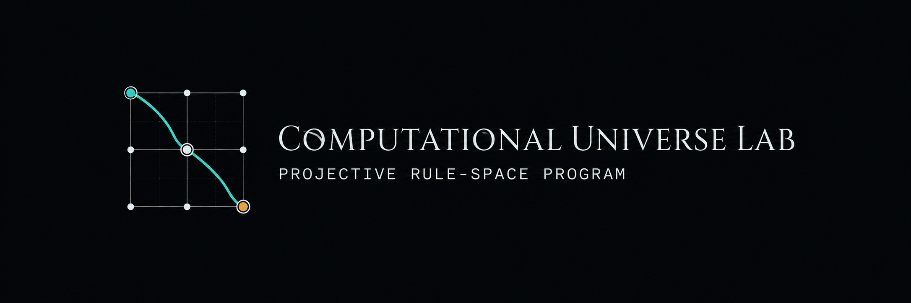

  

# docsv2：纲领 v2 文档体系（已生效，2026-07-26，依 `v2-裁定-D1D5` D5）

*建立于 2026-07-26,承可达性战役封存(`docs/status/阶段封存-2026-07-26-可达性战役收束-自旋2M3结构性不可达.md`)与 PI 决定("升级来看:四承诺该人为定义还是涌现?")。*

## 为什么有 v2

v1 纲领的北极星("自旋 2 从涌现走行动力学闭合",M3 二值门)已于 2026-07-26 正式封存:
四承诺全要时结构性不可达。v2 不是推翻 v1,而是把 v1 用生命换来的核心发现升级为新纲领:
**涌现不是二值的,是可测量的连续边界**。v2 的全部主张、里程碑与判据体系在本目录重建,
与 v1 严格分层,防止新旧主张混用。

## v1 / v2 关系(文档纪律,红线)

- **`docs/` 整体冻结为 v1 历史与证据链**:封存文档、总账、全部小报告与预注册保持原样,
  此后只加状态行、不改史、不迁移。v1 的 M3/M4、卡点、四承诺等术语**只在 v1 语境内有效**。
- **v2 文档引用 v1 一律用相对路径指向 `../docs/...`,禁止复制内容成双份**(同 v1 对
  `experiments/` 兼容链接的纪律)。
- **`data/results/`、`experiments/`、`visualizations/` 不分版本**,继续共用;结果真文件
  的证书链跨版本连续。
- v2 体裁沿用 v1:`纲领 / 预注册 / 小报告 / 复核 / 裁定 / 阶段封存`,文件平铺本目录,
  命名前缀 `v2-`。
- **生效条件**:本目录所有标 DRAFT 的文件须经 PI 裁定;裁定前 v1 的 AGENTS.md 阅读顺序
  不变,裁定后由 PI 批准更新 AGENTS.md/CLAUDE.md 指向 v2 入口。

## 阅读顺序(v2 生效后)

1. `v2-纲领-北极星-涌现边界制图.md` —— 总主张、主张分级、M0′–M4′ 门(本目录权威入口)
2. `v2-资产重审计-2026-07-26.md` —— v1 资产三分类(仪器/事实/主张依赖),v2 的继承清单
3. 当前战役对应的 v2 预注册与小报告
4. v1 侧背景:`../docs/status/阶段封存-2026-07-26-可达性战役收束-自旋2M3结构性不可达.md`
   (为什么会有 v2)与 `../docs/reports/讨论-2026-07-26-DHM长时推导范式对M3判定语言与可达性战役的启发.md`
   (极限语言门的方法论来源)

## 当前战役状态（2026-07-29）

M3′ 已完成设计自审、任务书签发和 Round 0 预飞：

1. `v2-任务书-M3-涌现边界制图.md` —— 签发终稿；
2. `v2-小报告-M3-预飞-2026-07-29.md` —— 当前权威判读；
3. `../data/results/v2m3_preflight.json` —— 结果真文件；
4. `../data/runtime/v2m3_state.json` —— 当前运行态。

当前状态为 **`READY-PILOT`**：legacy RC3-(ii) R2 仍因逐 `k` 谱投影被拒绝；独立的新
严格局域实空间 `q` 族已通过同一 Round 0 审计，其中稳定性覆盖冻结的 `64³` 全布里渊区，
生产宏步另与独立 symbol 和实际 Floquet 壳对拍。30 格 pilot 已解锁但未运行，M3′ 未 PASS、
未 FAIL，正式 `10²–10³` 扫描仍锁定。家族证书见
`../data/results/v2m3_local_family_certificate.json`，当前判读见预飞报告。

## 与 v1 术语的对照(防混用)

| v1 术语 | v2 对应 | 变化 |
|---|---|---|
| 四承诺 | 基底公理(酉+严格局域)+ 两条坐标轴(涌现度、约束标度) | 两条降格为可测参数 |
| M3(涌现走行动力学闭合) | M2′(复形+涌现物质耦合闭环) | 主语更换,门改极限语言 |
| M4(去孤岛) | M4′(大规模选择) | 保留,但以 M3′ 边界制图为前置 |
| 卡点④(单次联验) | M2′ 的定义本身 | 在新主语下重生 |
| "GR 涌现" | L4 涌现级主张(见主张分级) | 只有涌现度 ε→1 端有存活者才可恢复 |
