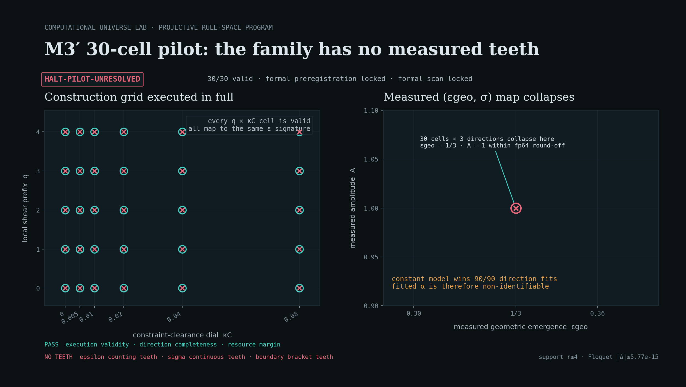

# v2 小报告：M3′ 30 格 pilot 实测与可分辨性复核

*Computational Universe Lab · Projective Rule-Space Program · 2026-07-30*

## 0. 裁定摘要

冻结的 `q × κ_C = 5 × 6 = 30` 格 pilot 已全部运行并完成同一次元判齿。当前状态为：

> **`HALT-PILOT-UNRESOLVED`**

这不是 M3′ 物理 FAIL，也不是 M3′ PASS。它只裁定：本轮严格局域实空间构造族虽然执行链
有效，但在运行后实测的 `(ε_geo, σ)` 坐标中没有形成可分辨的“牙齿”；因此
`formal_preregistration_unlocked=false`、`formal_scan_unlocked=false`，不得扩展
`10²–10³` 正式扫描。

下一唯一动作是回到 M0′ evaluator / 构造族追因，先找到能改变观测坐标而非只改变构造标签的
局域自由度，再另行预注册新 pilot。

## 1. 实际执行了什么

- 同一状态空间覆盖 `q=0…4` 与
  `κ_C∈{0,0.005,0.01,0.02,0.04,0.08}`；
- 每格通过真实 `realspace_step_factory` 执行 28 个规范基向量冲激，合计
  `30×28=840` 次实空间测量运行，另有 30 次实空间验证运行；
- 时间步只使用整数 roll、逐点线性代数与冻结局域基元；Fourier 求和只发生在运行后；
- 在轴向、面对角、体对角三个方向上，由实际 Floquet shell 测量
  `ε_geo=1-j_hand/N_curv`，并按冻结 R37 协议测量 `σ=(α,A)`；
- 30 格均执行成功，最大实测支撑半径为 4，与 `L` 无关；
- 本轮仅执行已解锁的 pilot，没有启动正式扫描。

冻结设计见 `v2-设计-M3-30格pilot实测-2026-07-30.md`，实施计划见
`v2-实施计划-M3-30格pilot实测-2026-07-30.md`。

## 2. 实测结果

| 项 | 结果 | 判读 |
|---|---:|---|
| 有效构造格 | `30 / 30` | 执行链有效 |
| 实空间测量运行 | `840 + 30` | 完整执行 |
| `N_curv` | 全部方向、全部格均为 `6` | 无计数变化 |
| `j_hand` | 全部方向、全部格均为 `4` | 无计数变化 |
| `ε_geo` | 全部为 `1/3` | 唯一签名数 `1` |
| `A`，轴向 | `[1.0, 1.000000000000001]` | 仅 fp64 舍入级变化 |
| `A`，面对角 | `[0.9999999999999999, 1.0000000000000018]` | 仅 fp64 舍入级变化 |
| `A`，体对角 | `[1.0, 1.0000000000000016]` | 仅 fp64 舍入级变化 |
| σ 方向判齿 | `90 / 90 FAIL` | 常数模型全胜；`α` 不可识别 |
| 最大 plane bridge 残差 | `3.129929141865289e-16` | 通过 |
| 最大 Floquet 模误差 | `5.773159728050814e-15` | 通过 |

σ 拟合器仍会为幂模型返回有限的 `α` 数字，但 90 个方向上常数模型全部取胜，且
`A=1+O(10^-15)`。这些 `α` 不能解释为已测得的连续标度律，也不能用于画出虚假的边界。



## 3. 冻结可分辨性复核

| 元判据 | 结果 | 证据 |
|---|---|---|
| execution validity | PASS | 30 格唯一、完整、均有效 |
| epsilon counting teeth | FAIL | 唯一 `(N_curv,j_hand)` 签名数为 1 |
| sigma continuous teeth | FAIL | 满足绝对裕度与 LOO 要求的 witness 为 0 |
| boundary bracket teeth | FAIL | 没有任何方向出现同射线 PASS/FAIL 括区 |
| direction completeness | PASS | 轴/面/体三个方向全部入册 |
| resource margin | PASS | 实测总裕度 `5.429774264983129 ≥ 1.5` |

前三个“无牙”判据共同阻止正式预注册。不能通过改阈值、放大 fp64 舍入噪声或只选择某一方向
恢复解锁。

## 4. 科学解释

Round 0 证明的是“这个家族严格局域、可执行、稳定且可测”；pilot 新证明的是“当前
`q/κ_C` 变化没有传递为 evaluator 能分辨的坐标变化”。因此问题已经从运行资源和实现正确性
收缩为构造—观测映射的结构性退化：

```text
(q, κ_C) 的 30 个构造标签
        ↓ 真实实空间运行
(ε_geo, σ) = (1/3, 常数 A≈1) 的单一观测点
```

本证据只支持“本构造族对冻结 M0′ evaluator 无牙”。它不支持“所有严格局域族都无牙”，也
不支持“M3′ 已失败”。

## 5. 资源与证据链

- 预飞外推：`33.872595 s`、`222,527,488 B`，裕度 `8.8567`；
- 实际累计：`55.250915666 s`、`244,219,904 B`，裕度 `5.42977`；
- 结果真文件：`../data/results/v2m3_pilot.json`；
- 运行态：`../data/runtime/v2m3_state.json`；
- 可视化：`../visualizations/figs/v2m3_pilot_map.png`；
- 结果 JSON SHA-256：
  `6358edc238095c7662b2a5e91c3a62ba72eac066cca57c8d6e70b5586b8caab0`；
- 图件 SHA-256：
  `d9466f2c21dd09d16a19299bbcda4f67dc5b7eb116e08c7aeb31a78e0156c80e`；
- 图件脚本 SHA-256：
  `70ef5fa1af45ce825f44cb0eeaefed57e0d5ca7c3d68ecaacea531cab22cf6e7`。

### 5.1 runner-only 收口附记

30/30 测量格已经按原冻结协议写入 checkpoint 后，JSON-safe 的字符串 `"inf"` 在恢复执行
元判齿时触发类型错误。收口只恢复这些不确定度诊断为非有限浮点值，没有重跑任何测量格，也
没有修改科学协议、依赖、环境或阈值：

- 原 runner SHA：
  `d7111a241477a6aeffad91d97533ffc33bca4e0de131110eccfbc25c4d147c3f`；
- 收口 runner SHA：
  `add4e517554407eef06d13afe425f92fe00a588a0e3c5eac017c3d023557c476`；
- `scientific_protocol_unchanged=true`；
- `measurement_cells_reexecuted=false`。

该附记已写入结果 JSON 的 `finalization_amendment`，不被隐去，也不被解释成新协议。

## 6. 停手与下一门

正式扫描继续锁定。下一轮若提出新构造族，必须先给出：

1. 为什么新增的严格局域自由度会改变 `N_curv/j_hand` 或连续 `σ`，而不只是更换构造标签；
2. M0′ evaluator 对该变化的已知正负控与非零判别裕度；
3. 独立的新 Round 0 与 pilot 预注册。

在以上条件满足前，不改阈值，不开 GPU 长跑，不把本轮方向级 FAIL 冒充 M3′ 物理 FAIL。
