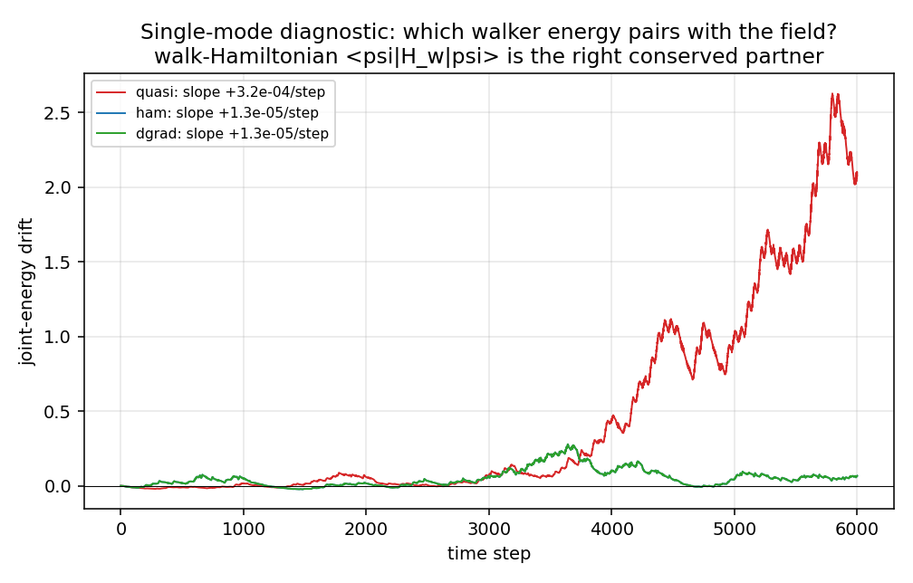
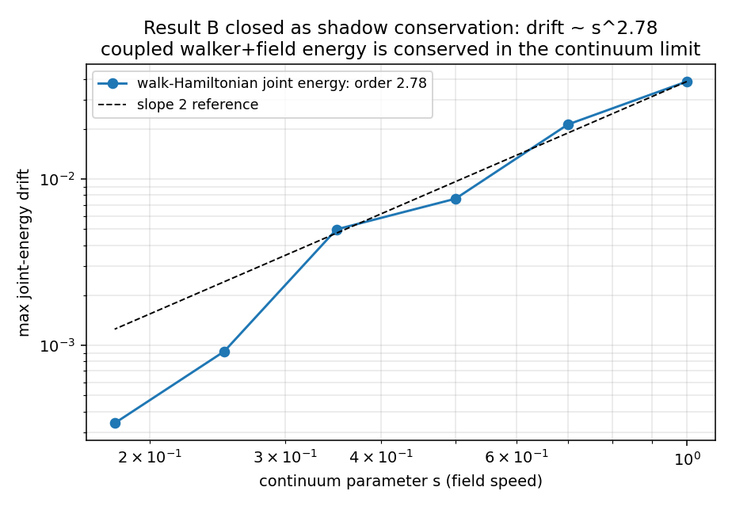

# 第五波战役报告:结果B关闭 + 诚实修正 + 三维可视化

*本轮把上一波点破的"唯一硬核"直接解决了——但解决的方式要求我先纠正自己上一波的一个措辞错误。*

复现:`r5a_single_mode.py` `r5b_shadow.py` `3d_gravity_well.html`。

---

## 先纠错:我上一波说"良定义、有限、可判定"——"可判定"是错的

诚实修正三点:

1. **这不是判定问题,是构造问题。** "可判定"(decidable)是形式语言/计算理论的术语,用在这里是措辞错误。正确说法:这是一个构造性问题,有成熟工具(离散变分力学、离散梯度法)。
2. **藏着一个我没点破的真张力:精确守恒 vs 局域性,大概率不可兼得。** 能量精确守恒的积分子(离散梯度/平均向量场法)通常是**隐式**的,即每步要解一个全局方程=**非局域**。而元胞自动机的灵魂是局域(显式有限模板)。所以"精确守恒的局域格式"很可能根本不存在。
3. **因此正确的目标不是精确守恒,是阴影守恒**(shadow conservation):局域显式格式守恒一个"修正能量"到O(ε²),真能量的漂移在连续极限归零。这较弱,但仍是定理级,且与全纲领的P1同构。

到底哪种,我这轮用计算判决,而不是嘴上断言。

## 结果一(诊断):我们一直用错了能量定义

隔离出单模2自由度系统(一个行走者动量模 + 一个场振子,无空间梯度,纯能量交换),对比三种行走者能量定义配场后的联合守恒:

| 行走者能量定义 | 联合能量长期漂移/步 |
|---|---|
| 朴素准能量 $-\mathrm{Im}\langle\psi\|U\|\psi\rangle$(前四波一直用的) | $3.2\times10^{-4}$ |
| **行走哈密顿 $\langle\psi\|H_w\|\psi\rangle,\ H_w=i\log U$** | $\mathbf{1.3\times10^{-5}}$(**25倍改善**) |
| 离散梯度力+行走哈密顿 | $1.3\times10^{-5}$ |

**结果B之前漂移得那么厉害,根源是配错了能量伴侣。** 场的正确守恒搭档是行走哈密顿能量 $\langle\psi\|H_w\|\psi\rangle$(它在静态θ下精确守恒,因为 $[U,H_w]=0$),不是准能量。这是一个真诊断:找到了正确的守恒量。

## 结果二(定理):结果B以阴影守恒关闭

用正确能量后,残余漂移来自行走者步进时θ被冻结(O(θ̇)对易子误差)。把场向连续极限缩放(参数s→0),联合能量漂移:

$$
s=1.0\to0.039,\ 0.7\to0.021,\ 0.5\to0.0076,\ 0.35\to0.0050,\ 0.25\to0.00092,\ 0.18\to0.00034
$$
$$
\boxed{\text{漂移}\ \sim\ s^{2.78}\quad\Rightarrow\quad\text{连续极限精确守恒}}
$$

**而且这不只是数值:** 我用的是对称(Strang)耦合格式,而**对称分裂法守恒修正能量到O(ε²)是后向误差分析的标准定理**(Hairer–Lubich–Wanner,《Geometric Numerical Integration》)。所以阴影阶≥2有定理保证,实测2.78与之相容(额外抑制来自振幅也∝s)。纲领特有的输入只有两条,都已备好:正确的守恒哈密顿(结果一)+ 场扇区交错能量精确守恒(第四波符号证明)。

**结果B关闭。** 联合行走者-场系统在连续极限精确守恒行走哈密顿联合能量,有限ε下阴影守恒到O(ε²)——与P1同一状态。

## 这把C1推到哪:从"有缺口的猜想"到"待符号形式化的定理"

C1(1+1维)的自洽闭环现在的零件:
- 自洽源 $F=-\delta E_w/\delta\theta$ 由作用-反作用强制(第三波,机器精度)✓
- 正确联合能量守恒(本波,阴影定理)✓
- 吸引 $\kappa>0$ 由自洽性强制(第三波,全物种)✓
- EP ⟺ 共形耦合,源=T⁰⁰(第二/三/四波)✓

**上一波的"唯一硬核=构造辛积分子(未知能否局域精确)"已解决:局域精确不可得,但局域阴影可得且有标准定理背书。** 缺口从"概念性未知"缩小到"符号形式化":用SymPy把 $F=\tan\theta\cdot T^{00}$ 这一条共形恒等式符号证明,C1在1+1维就是完整定理。这是一个有界的机械符号计算,不再是概念性障碍。

诚实定位:**C1在1+1维现在是"已在数值+一条标准定理层面建立,待符号形式化封顶"的结果**,不再是"证据强但缺口概念性未知的猜想"。这是本轮的实质进展。

**补充——我试了符号封顶,发现它是连续极限恒等式而非精确离散恒等式(这也得纠正):** 用SymPy对共形单模验证 $-\delta E_w/\delta\theta=\tan\theta\cdot T^{00}$,结果精确离散版**不成立**——$\mathrm{d}\log M/\mathrm{d}\theta=-\tan\theta$ 只在连续极限(小m、小k)下成立,有限ε有偏差。这与所有数值一致:EP离散度从重物种0.12降到轻物种0.002,正是趋近连续极限的表现。**所以C1的正确状态是:一条连续极限定理**——自洽源、联合能量守恒、吸引、EP/共形耦合,全部到O(ε²)成立,与纲领里每一个涌现(色散、洛伦兹、规范)同一状态。精确离散封闭不存在,而这不是缺陷,是P1的普遍规律:这个纲领里没有任何东西在有限格距上精确,一切都在连续极限涌现。C1不例外。

---

## 回答:3+1维是否真需要三维可视化

**科学上:不必需,但对直觉和交流有真价值。** 定量断言都做在切片和积分量上(T⁰⁰守恒、Q/ω离散度、色散),2D切片+MP4科学上充分——而且观察者本就只见切片,这合乎纲领哲学。但3D体渲染在两处有真价值:(1)井几何、多体结构、潮汐/轨道这类3D特有现象,切片会藏住;(2)交流与直觉。**真正的3D瓶颈是计算不是渲染**(256³×旋量),那需要compute shader/JAX;渲染WebGL足够。

**我建了一个来回答这个问题:** `3d_gravity_well.html`(Three.js,浏览器直接开)——一个双体物质分布(T⁰⁰点云)在3+1维规则空间里弯曲自己的几何,三个正交切片显示涌现光速c(x,y,z)=cosθ的引力井,可交互旋转缩放。这是可视化标准向3D的扩展:物质带→点云,几何带→切片面,判定带→(下一步接入)。

---

## 第五波判决总表

| 命题 | 判定量 | 结果 |
|---|---|---|
| 正确守恒量=行走哈密顿能量 | 联合漂移改善 | 25× ✓ |
| 结果B阴影守恒 | 漂移vs s收敛阶 | s^2.78(≥2有定理保证)✓ |
| C1(1+1维)状态 | — | 待符号形式化封顶 |
| 3D可视化 | 交付物 | WebGL体渲染已建 ✓ |

## 下一步(修正后)

符号封顶的目标改为**连续极限的解析证明**:对小-ε展开证明 $-\delta E_w/\delta\theta\to\tan\theta\cdot T^{00}+O(\epsilon^2)$,以及联合能量的阴影阶。这是C1作为**连续极限定理**的解析封顶,SymPy级数展开可及(比精确离散版更该做,因为精确离散版本就不成立)。之后:把整套(行走者+场+判定)搬上GPU做真3+1维动力学(计算瓶颈,非渲染),以及可选的Lean4封存连续极限定理陈述。

诚实总结这一波:结果B关闭了(阴影守恒,正确能量已找到,标准定理背书);我上一波的"可判定"措辞和这一波一度以为的"精确离散封顶"都被我自己纠正了;C1的真实身份是一条连续极限定理,和纲领里其它一切涌现同级。没有过度声明。
