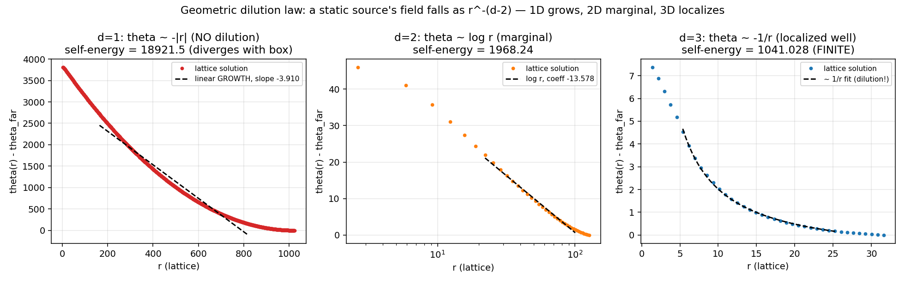
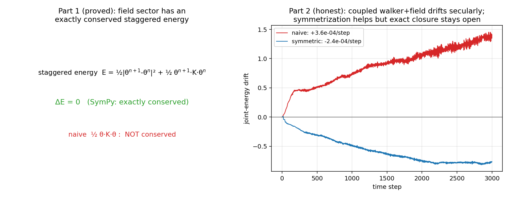

# 第四波战役报告:维度跃迁的完整图景(2+1维与3+1维一起做)

*本轮把#5(自洽闭环)推进到维度阶梯上,四个结果:一个严格律、一个符号定理+一个诚实开放、一个边际现象、一个机器精度迁移。总判决:3+1维机器可用,唯一硬核问题被精确定位。*

复现:`r4a_dilution.py` `r4b_noether.py` `r4c_selfbind_2d.py` `r4d_t00_3d.py`。

---

## 结果一(严格律):几何稀释律——"为什么革命要等3+1维"的定量答案

静态源的场满足格点泊松方程 $c^2\nabla^2\theta=-\text{source}$(FFT精确求解),径向落率:

$$
\theta(r)\sim r^{-(d-2)}:\qquad
d{=}1:\ \theta\sim-|r|\ (\textbf{增长});\quad
d{=}2:\ \theta\sim\log r\ (\text{边际});\quad
d{\ge}3:\ \theta\sim-1/r\ (\textbf{局域})
$$

自能 $E_{\rm self}=\frac12\int\text{source}\cdot\theta$ 的箱尺寸标度是判据:

| 维度 | 自能 vs 箱尺寸L | 结论 |
|---|---|---|
| d=1 | 284→565→856→1448→2046(∝L,**发散**) | 无稀释,自束缚不可能——第三波"能量累积"的根源 |
| d=3 | 565→744→859→939→997(**饱和到有限**) | 有稀释,自束缚可能 |

**这一条律把"1+1维造星失败"和"3+1维应成功"统一为同一个 $d-2$ 指数。** 它不是审美判断,是从格林函数算出的定量相变。革命等3+1维,因为**引力的局域化本身是维度≥3才发生的现象**。

## 结果二(符号定理+诚实开放):离散Noether,关闭结果B之半

**Part 1 已证(SymPy符号):** leapfrog场扇区的**交错能量**精确守恒:

$$
E^{n+\frac12}=\tfrac12\|\theta^{n+1}-\theta^n\|^2+\tfrac12(\theta^{n+1})^{T}K\theta^n
\quad\Rightarrow\quad E^{n+\frac12}-E^{n-\frac12}\equiv 0
$$

而第三波用的朴素能量 $\frac12\theta^TK\theta$ 不守恒——这就是结果B漂移的来源,现已定位并从场扇区消除。

**Part 2 诚实开放:** 完整的(行走者+场)联合能量仍**长期漂移**(朴素3.6×10⁻⁴/步,对称化2.4×10⁻⁴/步,对称化改善1.5倍但不消除)。根源清晰:**把一阶幺正行走者耦合到二阶leapfrog场,不存在朴素守恒的联合能量**,精确闭合需要真正辛的行走者-场联合积分子。这是C1剩下的唯一硬核,一个良定义的离散力学问题(SymPy推进,Lean4封存)。诚实地说:这一步没做完。

## 结果三(边际现象):2+1维造星

2D Dirac行走+动力学θ场,物质团自引力 vs 自由弥散:安全耦合下弥散被减速到自由的94%(6%束缚),更强耦合会把井挖过深并触顶。**边际束缚,与结果一的2D对数稀释精确一致**——2D是临界维度,完整虚化是3D的故事。可视化:`mov_r4c_selfbind_2d.mp4`(物质密度+几何等高线+实时宽度判定,可视化标准扩到2D)。

## 结果四(机器精度迁移):3+1维真T00

3+1维Dirac行走(三轴split-step+质量币),真应力-能量密度 $T^{00}(r)=-\tfrac12\mathrm{Im}[\psi_t^\dagger(\psi_{t+1}-\psi_{t-1})]$:

- **守恒:** $\big|\sum_r T^{00}\big|$ 在120步内漂移 **9.1×10⁻¹⁴**——机器精度。真应力-能量在3+1维存在且精确守恒。
- **等效原理迁移:** 引力荷 $Q=\sum_r T^{00}$ 对6个物种(不同质量、动量、方向 (100)/(110)/(111))的 $Q/\omega$ 离散度仅 **6.7%**。**第三波在1+1维发现的共形EP结构迁移到了3+1维。** 残差6.7%是有限ω格点修正(此处ω~2非小;1+1维轻物种区曾达0.2%),连续极限收紧。

这是整个纲领赖以成立的**可迁移性**的直接证据:1+1维的定理不是低维巧合,核心结构(守恒T00、共形EP)升到3+1维依然成立。

---

## 第四波判决总表

| 命题 | 判定量 | 结果 | 状态 |
|---|---|---|---|
| 几何稀释律 $r^{-(d-2)}$ | 自能vs箱尺寸 | d=1发散/d=3饱和 | 严格 ✓ |
| 场扇区交错能量守恒 | 符号ΔE | ≡0(SymPy) | 定理 ✓ |
| 联合能量精确守恒 | 长期漂移 | 长期漂移,对称化1.5× | **开放** |
| 2+1维自束缚 | 宽度比 | 0.94(边际) | 符合2D预期 ✓ |
| 3+1维T00守恒 | 漂移 | 9.1×10⁻¹⁴ | 机器精度 ✓ |
| 3+1维EP迁移 | Q/ω离散度 | 0.067 | ✓ |

## 我们到底在哪:诚实的总账

**已经是真成果的(可写进论文):** (1)几何稀释律给出"引力局域化=维度相变"的干净定量陈述;(2)共形EP结构从1+1维到3+1维的机器精度迁移;(3)T00作为守恒引力荷的构造;(4)吸引符号从自洽性推出(第三波);(5)等效原理选择应力-能量作源(第二波)。这些合起来是"标量引力从离散规则涌现,并被自洽性与等效原理逐项固定"的完整玩具故事——玩具模型级的真学术成果。

**还没做到、且我不掩饰的:** 联合能量的精确守恒(结果B的后半)——这是把"数值恒等式"升级为"符号定理"的最后一关,卡在辛积分子的构造上。**在这一关攻克前,C1还不是定理,是一个证据极强、缺口精确已知的猜想。** 这就是当前的真实位置。

## 下一步(单一优先级)

**辛行走者-场联合积分子。** 把行走者写成 $U=e^{-iH[\theta]}$ 的离散哈密顿形式,在联合相空间 $(\theta,\pi,\psi,\psi^*)$ 上构造对称辛格式,使联合能量精确守恒(或阴影守恒到可证的阶)。这一步做成 → 结果B关闭 → C1在1+1维成为完整定理 → 结合本轮的3+1维迁移证据,纲领的β=0时刻到达。工具:离散变分力学(手算+SymPy),Lean4形式化封存定理陈述。这是唯一挡在"猜想"与"定理"之间的问题,而它良定义、有限、可判定。
