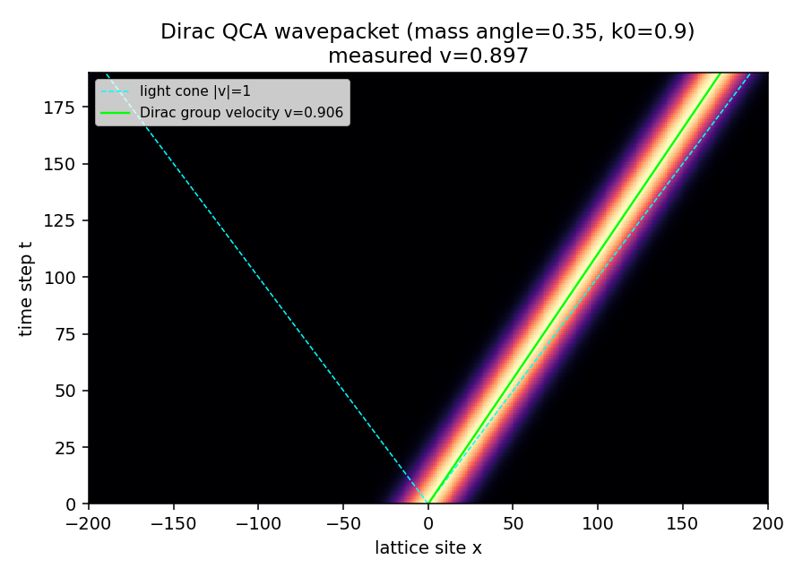
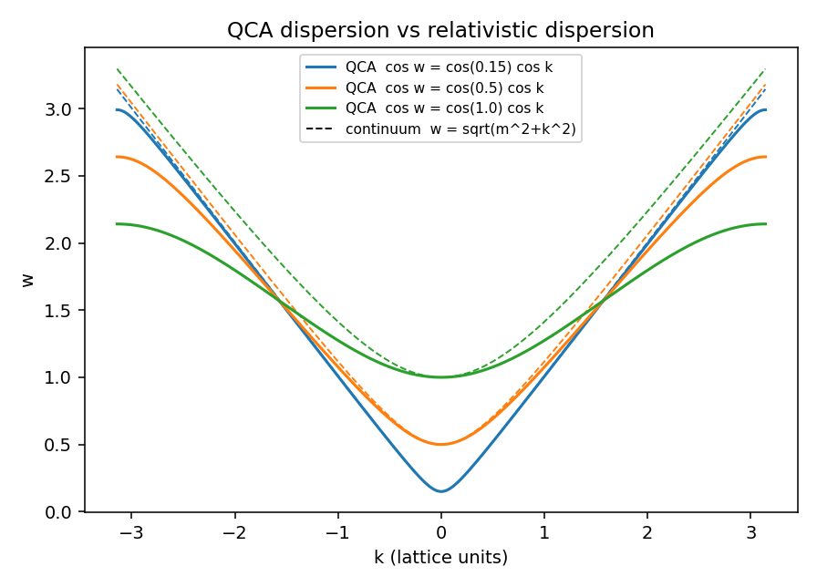
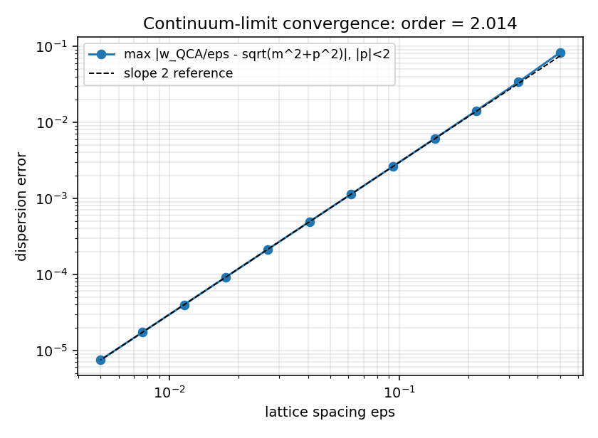
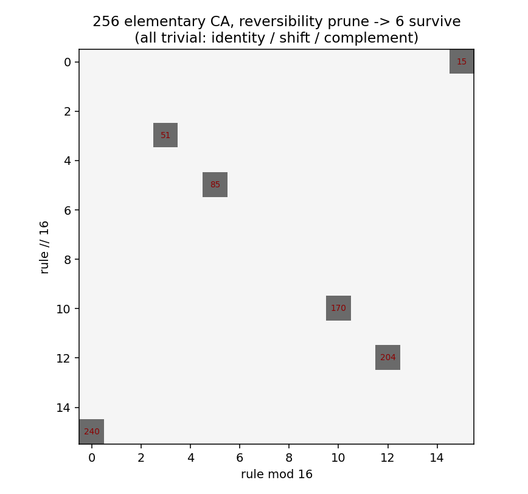
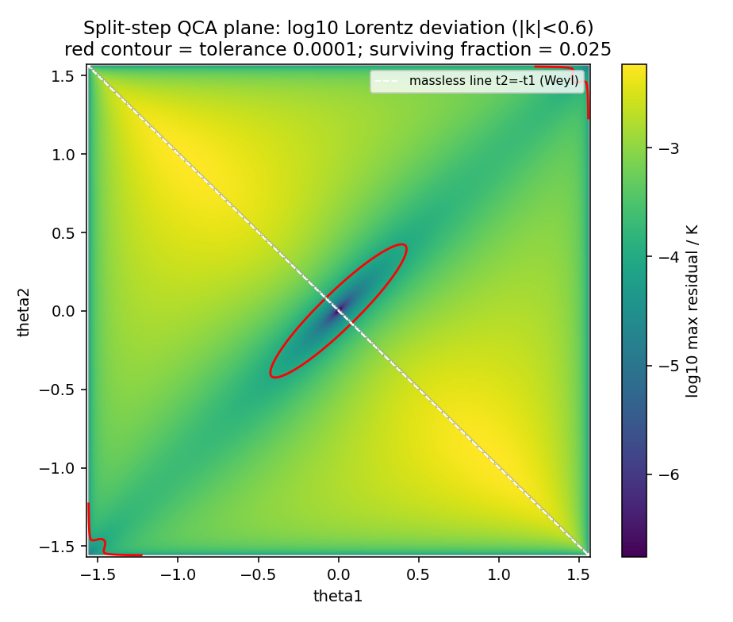
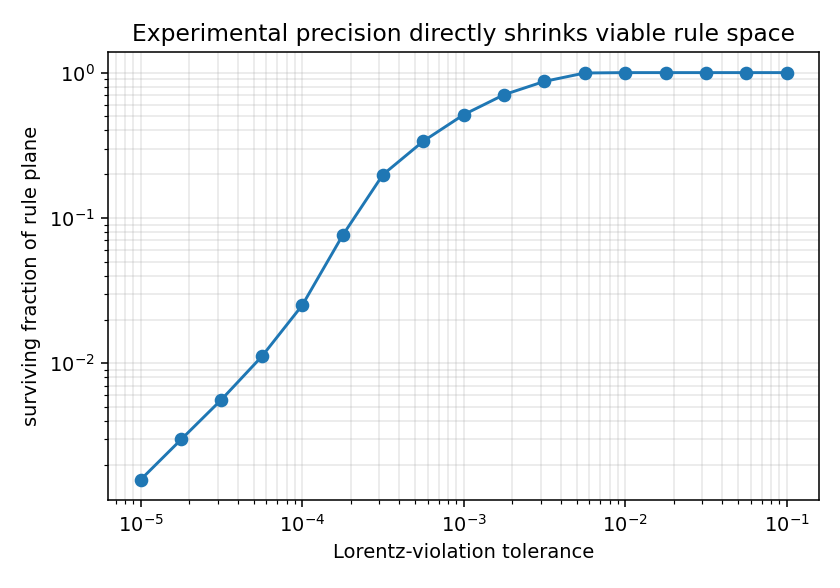
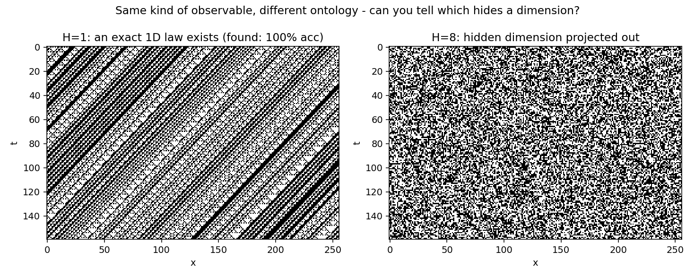
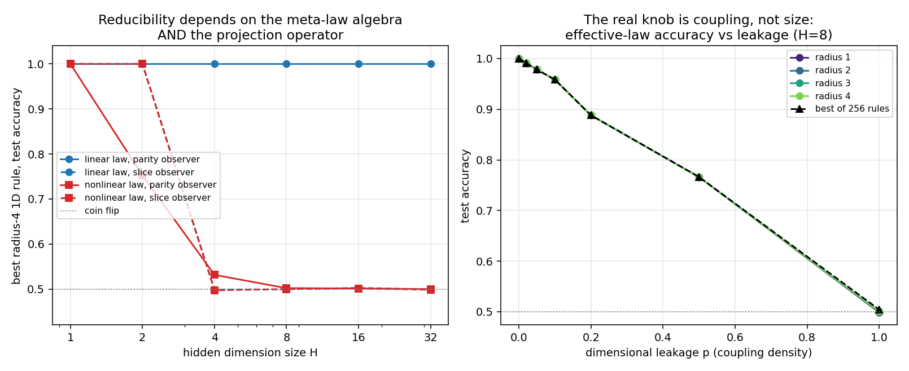
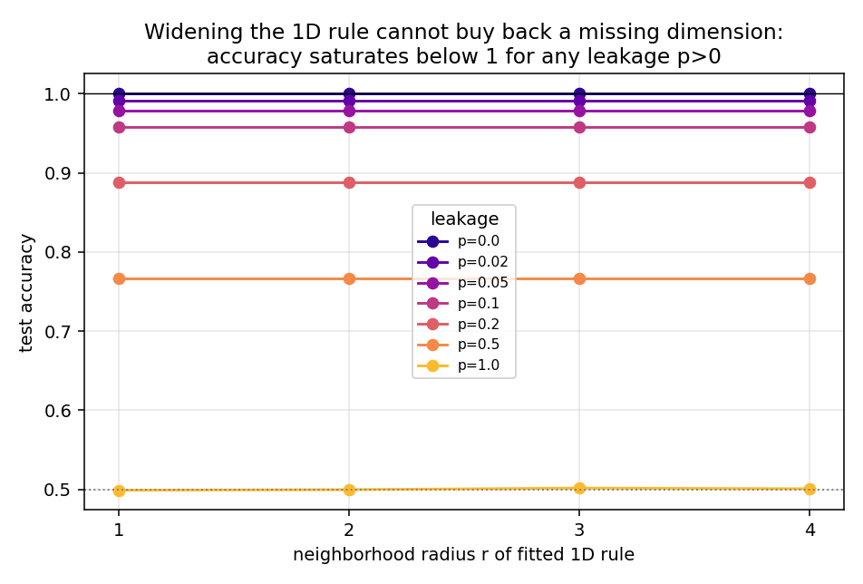
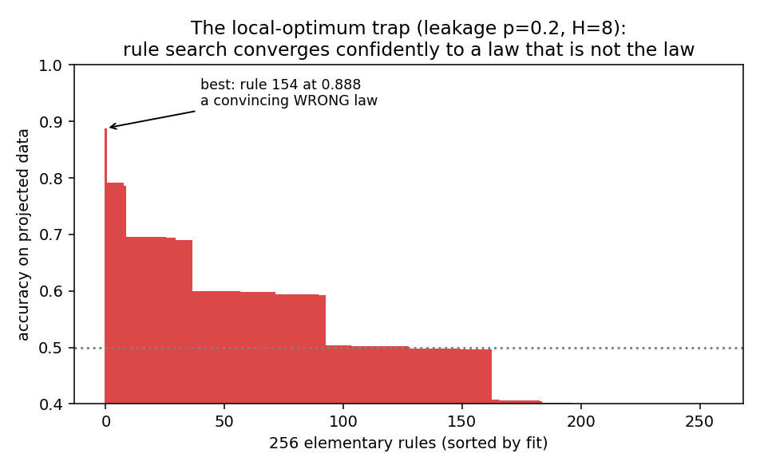

# 场CA、约束剪枝与投影陷阱:三个可计算实验

*对应讨论:能否用量子场概念推广元胞自动机规则、用已验证物理剪枝规则空间,以及"现有定律只是高维元定律的三维投影"这一猜想是否会让剪枝陷入局部最优。*

所有数值结果由 `exp1_dirac_qca.py`、`exp2_pruning.py`、`exp3_projection.py` 生成,可复现(随机种子固定)。交互版见 `lab.html`。

---

## 实验① 场CA确实能算出真物理:QCA→狄拉克方程

**设置。** 一维双分量量子元胞自动机(狄拉克量子行走):每步 = 质量币旋转(角度θ) + 分量依赖平移。精确色散关系 cos ω = cos θ · cos k。

**结果。**

- 波包群速度:实测 0.897 vs 狄拉克理论预言 0.906(偏差来自波包动量展宽),且严格被光锥 |v|=1 封住——相对论性因果结构不是加进去的,是规则的自动结果。
- 连续极限(ε→0, θ=mε):色散误差以 **2.014 阶**收敛到 E²=m²+k²,与理论O(ε²)一致。

**解决了什么:** "场概念+CA"不是比喻,是可执行程序——离散规则在封闭域内确实产出已验证物理的近似解,且逼近速率可定量控制。这正是D'Ariano纲领的最小可运行版本。

**Limit:** 洛伦兹不变性只在极限下涌现,任何有限ε都留下O(ε²)破坏印记(这个"缺陷"在实验②里反过来变成剪枝的刀);单粒子扇区,没有相互作用与纠缠;经典模拟多粒子QCA成本指数级。

---

## 实验② 剪枝确实有效,而且刀锋锋利度=实验精度

**经典侧。** 对全部256个初等CA施加"信息守恒"(可逆性,幺正性的经典影子):

只有6个规则存活:{15, 51, 85, 170, 204, 240}——全部是恒等、取反、平移的组合,**零物理内容**。这是一个尖锐结论:一维经典+局域+可逆的规则空间里根本没有物理,想要既守恒信息又有非平凡动力学,必须量子化。"借用场概念"不是可选项,是被逼出来的。

**量子侧。** split-step QCA双参数族(θ₁,θ₂),色散 cos ω = cos θ₁ cos θ₂ cos k − sin θ₁ sin θ₂。约束:低能窗口内偏离相对论色散 √(m²+c²k²) 的残差 < 容差。

容差1e-4时参数平面只剩 **2.5%** 存活,收缩到围绕无质量线 θ₂=−θ₁(Weyl族)的细流形。

存活体积随容差近似幂律收缩:1e-3→51%,1e-4→2.5%,1e-5→0.16%。**这就是"用实验公式剪枝"的定量形态:实验精度每提高一个数量级,可行规则空间缩小约一个数量级。** 现实中GRB光子色散把洛伦兹破坏压到10⁻¹⁵量级——按这个斜率,真实实验界限的剪枝力是毁灭性的。

**Limit:** 剪枝只能收缩到"与已验证物理低能等价"的流形,流形内部的简并(不同UV规则、相同IR极限)实验永远无法分辨——这正好是实验③的入口。

---

## 实验③ 投影陷阱:你的猜想的定量化

**设置。** W×H环面上的2D CA,H是隐藏维度。一维观察者只看到投影。两种元定律 × 两种投影算子:

| | 奇偶投影(整列XOR,集体模式) | 切片投影(只看y=0层,"膜"观察者) |
|---|---|---|
| **线性** c'=up⊕dn⊕lf⊕rt | 精确闭合 = rule 90,精度100%(任意H) | H≥4即坍缩到50% |
| **非线性** (+self∧lf项) | H≥4坍缩到50% | H≥4坍缩到50% |

**发现一:可约性是(元定律代数结构 × 投影算子)的联合性质。** 线性元定律的奇偶投影严格可约——搜索256个规则精确命中rule 90,100%精度,任意隐藏维度大小都成立。同一个元定律换成切片观察就完全不可约。所以"投影后是否存在三维定律"不是元定律单方面决定的,取决于我们的观测算子是否与元定律(部分)对易。

**发现二:真正的旋钮不是隐藏维度大小,是泄漏耦合强度。** 混沌隐藏扇区一旦强耦合,H=4和H=32没有区别(都立即到50%)。于是改测:可见层走精确1D定律,只在密度为p的稀疏位点接受隐藏维度泄漏(类比紧化维度的弱耦合):

弱耦合区精度精确遵循 **acc ≈ 1 − p/2**(微扰区),p=1时相变到完全混沌。这给出一个可反演的关系:**测得有效定律的违背率上界,即可反推维度泄漏耦合的上界**——这就是"用三维实验约束高维结构"的玩具版,与真实物理里用洛伦兹破坏界限约束额外维度参数在逻辑上同构。

**发现三:加宽1D规则买不回缺失的维度。** 半径1到4的拟合精度完全相同(小数点后三位不变)——失败原因不是1D模型表达力不够,而是所需信息在正交维度里,根本不在可见邻域中:

**发现四:局部最优陷阱是真实的、且是"令人信服的"。** p=0.2时,规则搜索坚定地收敛到rule 154,精度88.8%——一个高置信度的错误定律。搜索景观里它显著优于其余255个,任何以"拟合现有观测"为硬约束的搜索都会停在这里并宣布胜利:

**所以你的担忧被证实,但同时也给出了出路:**

1. 陷阱存在的判据可测。 如果精度以"加宽邻域/加深模型也无法消除"的方式饱和在1以下(发现三的模式),这个残差本身就是隐藏结构存在的证据——不可约的拟合残差是新维度的信号,不是噪声。现实类比:如果某个物理常数的"测不准"无论仪器多好都消不掉,就该怀疑投影不完备。
2. 硬约束要放在IR不放在UV。 正确的搜索姿势:让规则自由地高维、奇异,只要求某个投影/粗粒化在误差棒内复现三维物理。实验②的剪枝对象应该是"规则+投影算子"的组合,而不是规则本身。
3. "支持不同维度的rule"就是背景无关形式体系。 我们这里把H和p做成了参数;推到极限——维度本身可演化——就收敛到Wolfram超图重写。CA版(本实验)可定量但背景固定;超图版背景自由但难出数。中间道路:参数化维度的CA族(本实验的做法)作为可计算的脚手架。

**Limit:** 全部是经典玩具——没有纠缠,而真实的"投影"(如全息)本质上是量子的;投影算子是手选的两种,真实观测算子空间大得多;1+1维,W=509的有限尺寸;"计算不可约性"意味着这类测量只能靠跑模拟,规模化搜索昂贵。

---

## 综合:这条思路最终能算出什么

短期(本实验已给出方法):
- **存活体积函数** V(实验精度):图2c的斜率就是"每单位实验进步换多少理论空间收缩"的汇率,可以对更大的规则族系统地测;
- **精度—泄漏反演关系**:给定有效定律违背率上界δ,反推隐藏耦合上界 p ≲ 2δ(弱耦合区)。下一步把它搬到QCA上:在狄拉克QCA上加隐藏维度泄漏,预言色散修正形式,与真实洛伦兹破坏实验界限对接——这一步做成,玩具模型就开始接触真物理。

中期(需要升级工具):
- 把实验③的投影拟合从"查表规则"换成任意可微模型,系统地测"不可约残差谱"——哪些观测量的残差消不掉,消不掉的模式指向什么样的隐藏代数结构;
- 量子版投影实验:纠缠态的子系统约化(partial trace就是投影算子),测约化动力学的非马尔可夫性作为"泄漏"度量——这直接连到开放量子系统理论,数学工具是现成的。

诚实的天花板:这条路线能产出的是**约束和一致性结构**(什么样的元定律/投影组合与我们的观测相容),不是唯一答案。UV简并(实验②的limit)意味着"哪个规则是真的"可能原则上不可判定——但"哪些规则被排除"每一条都是真知识。物理学本来也是这么前进的。

---

## 文件清单

| 文件 | 内容 |
|---|---|
| `lab.html` | 交互实验室:三个模块可调参数实时模拟 |
| `exp1_dirac_qca.py` | QCA→狄拉克:时空图、色散、收敛阶 |
| `exp2_pruning.py` | 经典可逆性剪枝 + 量子洛伦兹剪枝 |
| `exp3_projection.py` | 投影可约性、泄漏扫描、局部最优景观 |
| `exp3_results.json` | 实验③全部数值 |
| `figs/` | 全部图表 |
